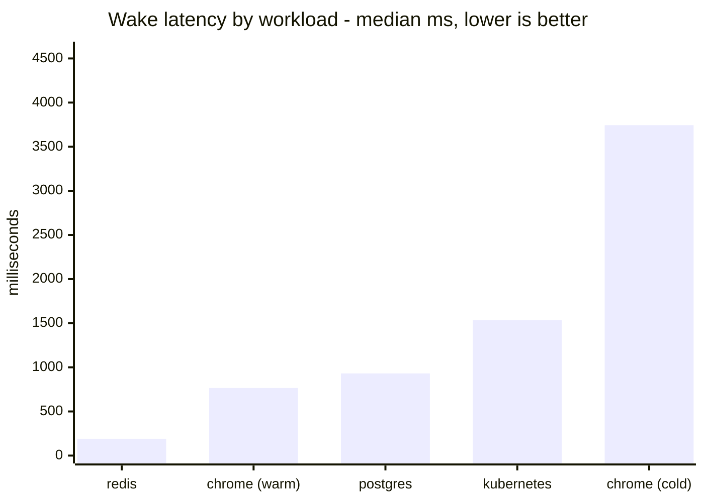
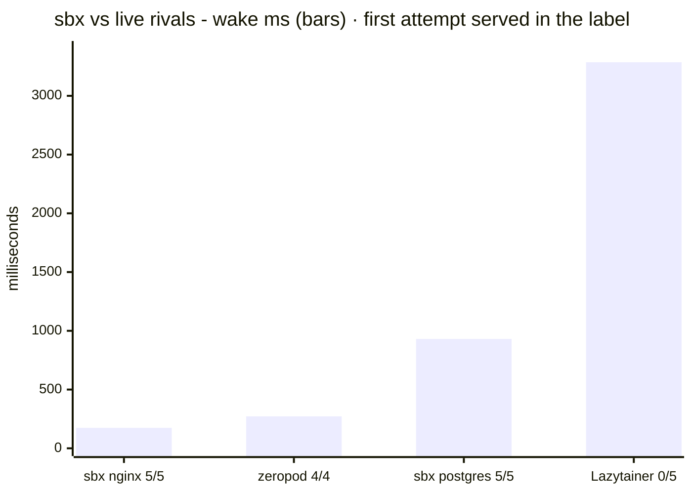
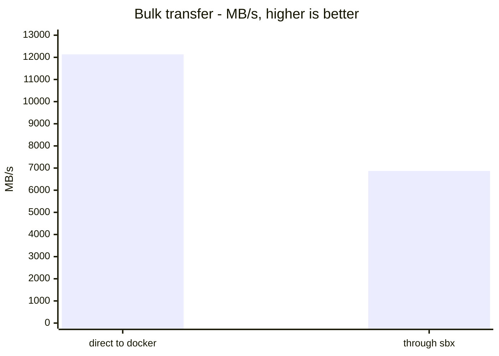
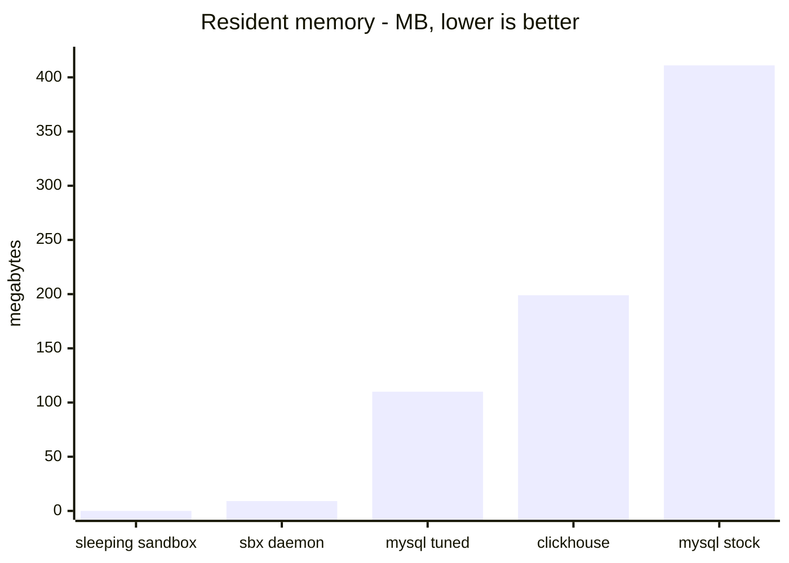

# sbx

[](https://github.com/aryanmehrotra/sbx/actions/workflows/ci.yaml)
[](go.mod)
[](go.mod)
[](LICENSE)

**One Go binary. Every branch, task or agent gets its own Postgres, Redis or browser - asleep
at 0 B of memory, awake on the first connection: 191 ms for redis, about a second for
postgres, and that first connection is *held* rather than refused.**


<sub>Recorded from a real run by [`scripts/demo.sh`](scripts/demo.sh) - the wake shown is whatever that machine did at that moment, not the benchmark median.</sub>

```sh
sbx serve --idle 5m &                          # once per machine, not per sandbox
sbx create my-branch --template postgres       # 492 ms once the image is local
eval "$(sbx env my-branch)"                    # it remembers what it was made from
psql -U app -d app                             # this wakes it
```

There is no `sbx start` and no `sbx stop`. **Opening a socket is the only signal**, so `psql`,
a connection pool, Playwright and a test runner all wake it without knowing it exists.

---

## What it's for

Five situations. They differ mostly in *who types the commands* - the tool is the same.

| | the problem | what sbx does |
|---|---|---|
| **Branches** | every branch shares one database, so a migration on one is a migration on all - and a stack per branch costs full memory for every branch you ever opened | a sandbox per branch. Only what you are looking at is resident - the ones nobody has queried cost **0 B of memory**, which is the measured figure in [BENCHMARKS.md](docs/BENCHMARKS.md) |
| **Agents** | an agent needs somewhere to work that dies with the task, and its clients - `psql`, a pool, a test runner - cannot call an SDK to wake anything | shell commands are the whole integration. `--shell json` for parsing, `sbx add` for a service the spec never declared |
| **Fan-out** | the expensive part of a sandbox per task is not the container, it is getting the data in | seed once, `sbx snapshot`, then `sbx fork` as many as you want. The migration runs once |
| **CI** | jobs spend longer waiting for a stack than running tests | `sbx ready` blocks until it is genuinely serving. On a persistent runner the next job reuses warm, migrated state |
| **A small team** | you want per-branch environments without buying a platform | the same binary on a box you already own, plus `sbx url` for a link that wakes on open |

→ [USE-CASES.md](docs/USE-CASES.md) for the *why* of each, with the numbers.

---

## Features

| | |
|---|---|
| **Wakes on any TCP connection** | no SDK, no client library, no wrapper. Anything with a socket |
| **Sleeps to 0 B** | a stopped container with its volume intact - an idle sandbox costs no memory at all |
| **Holds the first connection** | it waits rather than refusing - **5/5 measured**, where a rival that refuses scores 0/5 |
| **One static binary** | zero non-stdlib dependencies, CI-gated. darwin · linux · freebsd on amd64 · arm64; **Windows via WSL2** (sbx cannot dial a Windows named pipe) |
| **One committed file** | `sandbox.json` describes what a branch needs. → [SPEC.md](docs/SPEC.md) |
| **A box for your own commands** | `mounts` puts the repository in a service with your toolchain, so `sbx exec -t my-branch dev sh` is a shell in your code - it sleeps like everything else and `exec` wakes it - [how](docs/USE-CASES.md#9--a-box-to-run-your-own-commands-in) |
| **Templates built in** | `--template postgres` works with nothing on disk. Pinned by digest, dated |
| **Snapshot & fork** | save every service's data, then make as many sandboxes from it as you want |
| **Builds your image** | `build: {context}` instead of `image:`, cached by a hash of the context - not a clock |
| **Ordering & secrets** | `depends_on` for creation order, `${VAR}` so a committed spec names a secret without holding it |
| **Limits** | `cpu`, `memory`, `gpus` per service - a laptop running twenty sandboxes needs a ceiling |
| **Egress deny** | a bridge with no NAT: nothing routed leaves, and it is still reachable and wakeable |
| **Isolation tiers** | `--isolation gvisor\|kata`, refused with a reason where the runtime is absent |
| **Two runtimes** | the same spec locally on docker or in a cluster on kubernetes - not the same capabilities either way, and `sbx doctor` tells you what this host can do |
| **Housekeeping** | `sbx gc` reclaims what dead sandboxes left, listing by default and deleting only with `--force` |
| **Deploy it anywhere** | `sbx pack` writes the image for a platform that gives one container and one HTTP port; `sbx connect` turns that back into ordinary local ports - several deployments merge into one local port map, so a sandbox spread over a platform still looks like one - [walkthrough](docs/USE-CASES.md#8--a-sandbox-that-is-not-on-your-laptop) |
| **A live dashboard** | `sbx ui` - every sandbox, awake or not, with cpu and memory per service against what it is allowed, and a trace of where each has been. `v` folds it to one line per sandbox: what it holds, how many are up, what the whole thing costs, and each service's share. `a` shows the machine instead - every container on it, ours or not - and the title carries both machines, since on macOS the VM's ceiling and the laptop's are different numbers. Wake, sleep, read logs, set a limit and remove from the keyboard |
| **Reads as well as prints** | `--json` on `list`, `doctor`, `history` and `env`, so an agent driving this parses answers instead of column widths. → [AGENTS.md](docs/AGENTS.md) |
| **History and audit** | `sbx history` records what changed and every wake, with secrets redacted. It reads a file, so it works when docker does not |
| **Observability** | structured logs on one stdout; [`console/`](console/) adds metrics and health - a *separate* module, so it has dependencies and the daemon still has none |

---

## What each backend can do

The spec is the same file on both and the everyday commands are the same. The capabilities are
not, and neither is the footing: **locally a Docker-compatible runtime is a prerequisite** -
Docker Desktop, Colima, Rancher Desktop or rootless podman - and on macOS or Windows that
runtime is a Linux VM, because a Linux container is a set of Linux kernel features. That is a
property of containers rather than a gap here; on Linux there is no VM at all.

Where a capability is missing it is refused with a reason naming the backend rather than
approximated, and `sbx doctor` says what this host can actually do.
[COMPARISON.md](docs/COMPARISON.md#same-spec-two-runtimes---and-not-the-same-capabilities) has
the exhaustive table; the short version:

| | local · docker | cluster · kubernetes | |
|---|:---:|:---:|---|
| Wake on connect, sleep to 0 B, `list` · `env` · `logs` · `exec` · `cp` · `rm` · `ready` | ✅ | ✅ | the everyday commands, identical on both |
| **cpu / memory limits** | ✅ | ⚠️ | `cpu` and `memory` per service, and `L` in `sbx ui`. Docker adjusts the container in place; a cluster patches the Deployment, **which rolls the pod** — and needs credentials that may patch Deployments. The shipped activator Role deliberately cannot ([`deploy/activator.yaml`](deploy/activator.yaml) grants `deployments/scale` only), so this works from your kubeconfig, not from inside the cluster |
| **removing a limit once set** | ❌ | ✅ | docker's update API reads a zero as "leave unchanged", so a container keeps its ceiling until it is recreated |
| **cpu / memory usage** | ✅ | ❌ | reading it from a cluster needs metrics-server, which is the operator's decision. Rows read `n/a` there rather than pretending a sample is coming |
| `gpus:` · `snapshot` · `fork` · `gc` · `build:` · `prewarm` · `egress: "deny"` · `sbx url` | ✅ | ❌ | each refused in a cluster with a reason - the cluster answers are a device plugin, a CSI snapshot, a NetworkPolicy and an Ingress, none of which is the docker one in a hat |
| `--isolation gvisor\|kata` · history · one committed `sandbox.json` | ✅ | ✅ | a RuntimeClass in a cluster; refused wherever the runtime is absent |

---

## The dashboard

`sbx ui` - the fleet, what each service is using against what it is allowed, and where it has
been. Recorded from a real run by [`scripts/ui-shot.sh`](scripts/ui-shot.sh) rather than drawn,
for the same reason as the demo above: a hand-drawn dashboard keeps a column that was renamed
and a key that was rebound.


The bars and the traces are scaled to each service's own ceiling, so height means fullness, and
every point is coloured by what was happening when it was drawn - a line can be red on the left
and green on the right. `L` sets a limit on the selected service without leaving the dashboard.

---

## How to use

```sh
brew install aryanmehrotra/tap/sbx
# or
curl -fsSL https://raw.githubusercontent.com/aryanmehrotra/sbx/main/scripts/install.sh | sh
# or
go install github.com/aryanmehrotra/sbx@latest
```

Then run the daemon once - it owns the ports `sbx env` hands out, so nothing works without
it. [`deploy/`](deploy/) has a launchd plist and a systemd unit, both running as you, not
root. Check the machine first, and prove the whole cycle on it (~9 s once images are local):

```sh
sbx doctor       # what this host can and cannot do
sbx selftest     # create, sleep to zero, wake on a socket, data intact
```

### A branch

```sh
git switch feature-x
sbx create feature-x                  # reads ./sandbox.json - `sbx init` writes one for you
eval "$(sbx env feature-x)"           # DATABASE_PORT=20002, REDIS_PORT=20003...
npm test                              # your tooling, unchanged
```

Switch away and it sleeps on its own. Switch back and the first query wakes it.

### An agent

```sh
sbx create task-4711 --template postgres          # nothing on disk needed
sbx env task-4711 --shell json                    # {"DATABASE_HOST":"127.0.0.1", ...}
sbx add task-4711 cache --image redis:7-alpine --port 6379 --health 'redis-cli ping'
```

It connects with whatever tool it was going to use anyway, and the connection *is* the wake
signal. If the agent runs code you did not write, add `"egress": "deny"` - and read
[the limits](#honest-limits) first.

### One seeded database, many agents

```sh
sbx create main --template postgres
sbx exec main postgres psql -U app -d app -f /tmp/schema.sql   # seed once
sbx snapshot main golden
sbx fork golden agent-1                                        # as many as you want
sbx fork golden agent-2
```

A write in one is invisible to the others. Filesystem state only - processes start cold
against warm data.

### CI

```sh
sbx serve --idle 30m &
sbx create "$BRANCH" && sbx ready "$BRANCH"   # blocks until it is actually serving
eval "$(sbx env "$BRANCH")"
./run-tests.sh
```

`sbx prewarm` moves the image pull into a step your runner can cache.

### On Kubernetes

The same spec, the same commands, `--provider kubernetes`:

```sh
sbx create my-branch --provider kubernetes --namespace sbx
sbx env    my-branch --provider kubernetes
```

Services become Deployments and Services in that namespace, and
[`deploy/activator.yaml`](deploy/activator.yaml) is the in-cluster component that plays the
daemon's part. `build:` and `egress: "deny"` are **refused** there rather than approximated -
[USE-CASES.md](docs/USE-CASES.md) explains why.

### Every command

| | |
|---|---|
| `sbx create` / `rm` | make one from `sandbox.json` or `--template`, destroy it with its data |
| `sbx env` | exports for your tooling - posix, fish, powershell, cmd, **json** |
| `sbx ready` | wake it and block until it's serving - the CI one-liner |
| `sbx exec [-t]` | run anything inside it; `-t` attaches a terminal for a shell or `psql` |
| `sbx logs [-f]` | **every service on one stdout**, structured - the one command that does *not* wake anything |
| `sbx cp` | files in and out (`:` marks the inside path) |
| `sbx add` | drop in a service nobody declared - the agent affordance |
| `sbx url` | a public link that wakes it when opened |
| `sbx snapshot` / `fork` | save every service's data, then make as many sandboxes from it as you want |
| `sbx init` / `validate` | ask what this branch needs and write the spec · check one without creating anything |
| `sbx prewarm` | pull the images now, so the first create isn't a download |
| `sbx gc` | reclaim volumes whose sandbox is gone; `--snapshots` includes saved states, `--force` actually deletes |
| `sbx doctor` | what this machine can and cannot do, before you rely on it |
| `sbx list` · `sbx ui` | what exists and what's awake · the same, live, with cpu and memory |
| `sbx history` · `sbx templates` | what happened and who did it · the built-in specs |
| `sbx serve` | **the daemon** - owns the ports, does all waking and sleeping; one per machine |
| `sbx selftest` | the whole cycle, on your machine |

Every command that touches a sandbox takes `--provider docker|kubernetes`, `--namespace`,
`--isolation container|gvisor|kata` and `--socket` - `serve` takes all but `--isolation`,
plus `--idle`, `--refresh` and `--ready`. `SBX_PROVIDER_KIND`, `SBX_NAMESPACE` and
`SBX_ISOLATION` set the defaults, and `DOCKER_HOST` is honoured.

---

## How it compares

**Nothing has to call an SDK to wake a sandbox.** A connection pool can't call
`sandbox.connect()`, and neither can `pg_dump`, a migration tool or a test runner somebody
else wrote. Fly's proxy and Knative's activator manage that too - Fly's is in Fly's cloud,
Knative's is HTTP only. *Any protocol, on your own machine, with no account* is the corner
nobody else is in.

And waking is not the hard part; **holding the connection while it wakes** is. A client that
gets refused and does not retry is a client that fails, and most don't retry:

| | wakes on | so the client can be | first attempt served |
|---|---|---|---|
| **sbx** | **any TCP connection** | anything with a socket | **5/5 measured**, nginx and postgres |
| E2B · Daytona · Modal · Vercel · Cloudflare | an SDK call | only your own code | your code retries |
| Fly Machines | a request through Fly Proxy | anything, incl. TCP | held by the proxy |
| Knative | an HTTP request | HTTP/gRPC/WS only | held by the activator |
| Lazytainer | packets crossing a threshold | anything that **retries** | **0/5 measured** - refused, then served 5 s later |

That last row is the one measurement in this project where a live rival was run side by side
and lost outright.

**Yes, if** your branches share one database; if an agent needs somewhere to work that dies
with the task; if CI spends longer waiting for a stack than running tests.

**No, if** you need to run code you did not write - a container shares your kernel, and E2B,
Vercel Sandbox or Modal give you a real one. Or if you want somebody else to operate it:
that's Neon, and always will be.

→ [COMPARISON.md](docs/COMPARISON.md) - the full field, every claim sourced or measured,
including where we lose and a table of the figures this project got wrong and corrected.

### Honest limits

**The wake is paid on `connect`, not on the query.** A client that gives up connecting in
two seconds will give up on a cold postgres. Raise its connect timeout - `PGCONNECT_TIMEOUT`
for libpq - and expect a pooled client to see a server-initiated close when a sandbox sleeps.

A container shares the host kernel unless you run `--isolation gvisor`, which CI proves end
to end. Egress can be denied but not filtered by domain. Memory is not restored, so a wake
starts processes cold. **This has not yet been run in production anywhere outside its own
test suite** - what *is* exercised on every push is below.

---

## Benchmarks

Every number below was measured by a script in this repo, on the machine named beside it.
→ [BENCHMARKS.md](docs/BENCHMARKS.md) for conditions, distributions and how to re-run each.

**Level 1 - the wake.** What a caller waits for when it connects to a sleeping sandbox. The
workload dominates, not sbx: a browser is slow because Chrome is slow to start.



`redis 191 · chrome warm 766 · postgres 931 · kubernetes 1534 · chrome cold 3744`

**Level 2 - against the field.** Same harness, same machine, same rules: a sample counts only
on a correct protocol reply, and the target must be verifiably asleep at t0.



`sbx nginx 174 (5/5) · zeropod 272 (4/4) · sbx postgres 931 (5/5) · Lazytainer 3286 (0/5)`

zeropod is faster than it looks and restores RAM, which sbx does not - that row is the one we
lose, and it is measured rather than conceded. Lazytainer's 3286 ms is mostly *refusals*: it
served the first attempt zero times out of five.

**Level 3 - the steady state.** The wake is a one-off; these are what every operation pays
for the life of the sandbox. Note the units - the scale spans five orders of magnitude:

| level | direct | through sbx | cost |
|---|---|---|---|
| a request on an open connection | 14.5 µs | 30.1 µs | **+15 µs** |
| opening a new connection | 0.69 ms | 0.79 ms | **+0.1 ms**, inside the noise |
| bulk transfer | 12136 MB/s | 6870 MB/s | **−43%** |

The middle row was **68 ms** until this project measured it: the daemon re-ran the health
check through `docker exec` on every accepted connection, and no benchmark here could see it
because they all measured six bytes on one connection.



`direct 12136 MB/s · through sbx 6870 MB/s`

**Level 4 - memory at rest.** The number the whole design exists for.



`sleeping sandbox 0 · sbx daemon 9.1 · mysql tuned 110 · clickhouse 199 · mysql stock 411`

A sleeping sandbox is 0 B of memory and the volume it already had. The daemon fronting every
sandbox on the machine is 9.1 MB - *corrected from a published 4.5 MB, which was wrong.*

---

## Docs

| | |
|---|---|
| [AGENTS.md](docs/AGENTS.md) | **pointing Claude, Codex or any agent at sbx** - a block to paste, and the four things that are not obvious |
| [SPEC.md](docs/SPEC.md) | every field of `sandbox.json`, and a docker-compose mapping |
| [USE-CASES.md](docs/USE-CASES.md) | seven shapes this fits, and the ones it doesn't |
| [ARCHITECTURE.md](docs/ARCHITECTURE.md) | the pieces, both data paths, addressing |
| [COMPARISON.md](docs/COMPARISON.md) | against E2B, Daytona, Modal, Fly, Neon, Knative, zeropod |
| [BENCHMARKS.md](docs/BENCHMARKS.md) | every number, and the script that produced it |
| [TROUBLESHOOTING.md](docs/TROUBLESHOOTING.md) | what to do about what you're seeing |
| [DECISIONS.md](docs/DECISIONS.md) | why it's shaped this way - mostly things that broke |
| [console/](console/) | metrics, health and a read-only API for a running daemon |
| [CONTRIBUTING.md](CONTRIBUTING.md) | how the test tiers are arranged, and what a change should come with |
| [SECURITY.md](SECURITY.md) | the threat model, what counts as a vulnerability, and where to report one |

MIT. Issues and patches welcome.
