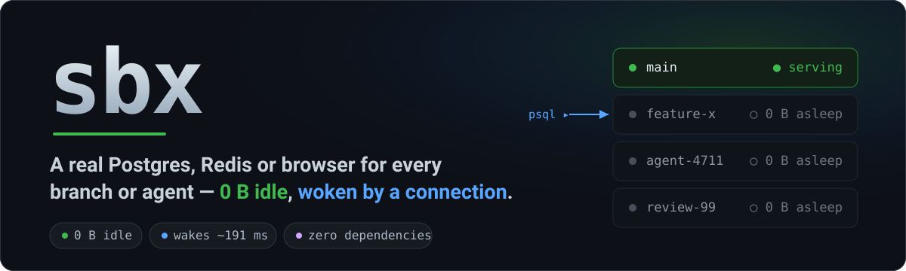
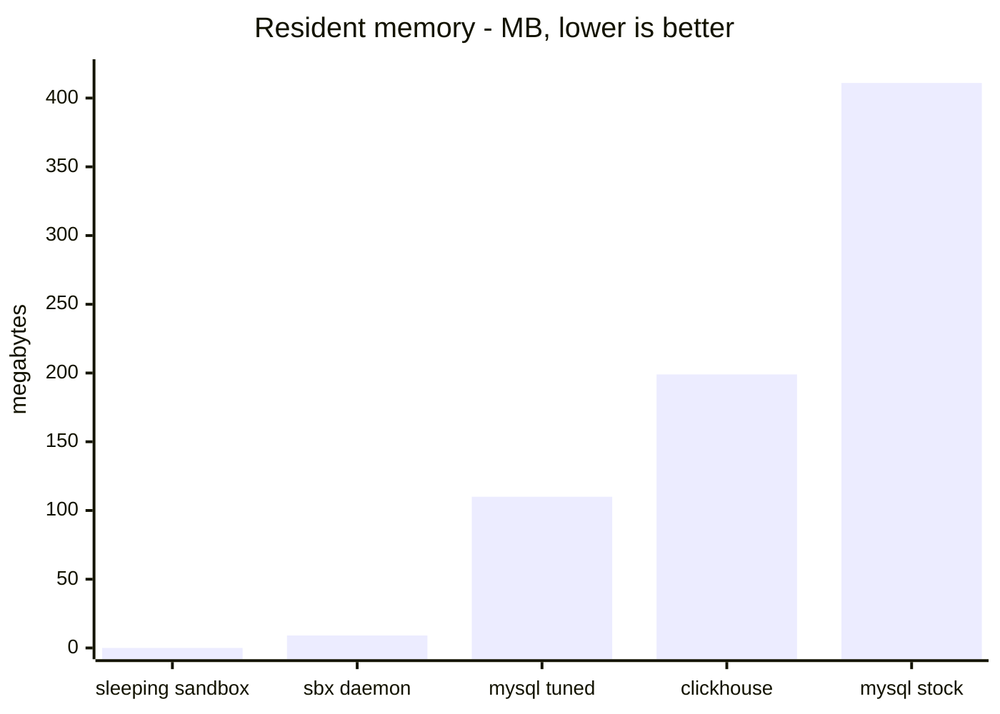
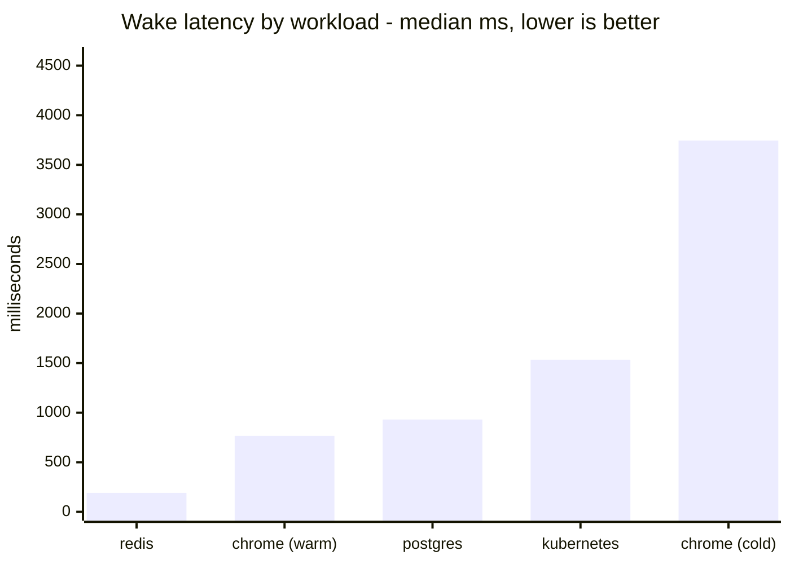

# sbx

[](https://github.com/aryanmehrotra/sbx/actions/workflows/ci.yaml)
[](https://pkg.go.dev/github.com/aryanmehrotra/sbx)
[](https://goreportcard.com/report/github.com/aryanmehrotra/sbx)
[](https://github.com/aryanmehrotra/sbx/releases)
[](go.mod)
[](LICENSE)



**Give every branch, task or AI agent its own real Postgres, Redis or browser — one that costs
nothing while idle, and comes back the instant something needs it.**

`0 B of RAM when idle · wakes in ~191 ms · one static binary, zero dependencies`

## The connection is the wake-up call — and it never gets refused

Point `psql`, a connection pool, Playwright or your test runner at a sleeping sandbox and it
**just connects.** sbx catches that first connection and holds it open while the container starts,
then hands over the live socket — the client waits a beat and gets a real answer, and never sees a
refused port. **The client's own socket is the wake signal:** no SDK call, no `sbx start`, no
readiness loop in your code. The connection itself is the start command, and it succeeds on the
first attempt — on any protocol that speaks TCP.

That last part is the piece a hand-rolled `docker start` wrapper can't give you. Everything else
here is built around it: sandboxes that drop to **0 B** when nobody's using them, and come back the
moment anyone does.

## Who it's for

- **Teams running many branches at once** — twenty branch databases on one laptop, and you pay RAM
  for only the one you're looking at. Switch branches and the rest drop to 0 B. No more everyone
  sharing one staging database and stepping on each other's migrations.
- **A fleet of AI agents that each need a real database** — hand every agent its own Postgres that
  dies with the task, woken by its clients (`psql`, a pool, a test runner — none of which can call
  an SDK) just by connecting. Keeping every agent's stack alive isn't affordable; a shared database
  is where the flaky, hard-to-reproduce bugs come from.


<sub>A real run, recorded by [`scripts/demo.sh`](scripts/demo.sh).</sub>

## Get a database in three commands

```sh
sbx serve --idle 5m &                          # once per machine, not per sandbox
sbx create my-branch --template postgres       # ~492 ms once the image is local
eval "$(sbx env my-branch)"                    # DATABASE_HOST/PORT are now set
psql -U app -d app                             # this wakes it — the call blocks, it doesn't refuse
```

There is no `sbx start` and no `sbx stop`. Opening a socket is the whole signal, so `psql`, a
connection pool, Playwright and your test runner all wake it without knowing sbx exists.

---

## What you can do

**Everyday**
| | |
|---|---|
| **Run twenty branch databases on one laptop** | so the ones you're not looking at cost 0 B — no RAM, no bill |
| **Point your existing tools at it, unchanged** | so anything that opens a socket connects — no SDK, no client library to add |
| **Keep one file per repo** | `sandbox.json` says what a branch needs, so a teammate's `sbx create` matches yours → [SPEC](docs/SPEC.md) |
| **Spin one up with nothing on disk** | `--template postgres`, `browser`, `nginx`, `web-stack` (Postgres + Redis), or `analytics` — so you're never blocked writing a spec first |

**For AI agents**
| | |
|---|---|
| **Give every agent its own workspace** | so one agent's writes can never corrupt another's — `--shell json` when a script is reading, not you |
| **Add a service mid-task** | `sbx add task cache --image redis:7-alpine` — so an agent that finds it needs a cache doesn't stop to edit a spec |
| **Hand each agent its own copy of a seeded database** | `sbx snapshot` once, `sbx fork` as many as you want — so a write in one is invisible to the rest |
| **Park an agent mid-thought and bring it back** | `sbx checkpoint` / `sbx resume` — memory and processes, not just disk |
| **Run one for a single test, gone after** | `sbx with test-db --template postgres -- go test ./...` — so it's always torn down, even on failure |
| **Let an agent reach only the APIs you allow** | `egress_allow: ["api.openai.com"]` — the box reaches the listed hosts and nothing else, enforced by a filtering proxy; there's no route around it |
| **Keep a box awake while it works** | `idle: "never"` — an agent computing inside sends no traffic through the port, so this stops the idle timer from sleeping it mid-task |

**Scale it up**
| | |
|---|---|
| **Keep twenty sandboxes polite on one laptop** | `cpu`, `memory`, `gpus` per service, so one runaway agent can't starve the rest |
| **Build your own image** | `build:` instead of `image:`, cached by content hash — so a second create does no rebuild work |
| **Take the same spec to a cluster** | `--provider kubernetes`, so what worked on your laptop is what runs in CI |
| **Deploy anywhere and still drive it from your terminal** | `sbx pack` + `sbx connect` turn a one-port platform back into local ports |

**See and drive the fleet**
| | |
|---|---|
| **Watch every sandbox live** | `sbx ui` — cpu and memory against each service's own ceiling, and where it's been |
| **Drive a deployment from your laptop's terminal** | `sbx ui --connect <url>` — wake, sleep, limit, remove, tail logs, `f` to port-forward here |
| **Read it from a script instead of a screen** | `--json` on `list`, `doctor`, `history`, `env` → [AGENTS](docs/AGENTS.md) |
| **Know who changed what, and when** | `sbx history` records every change and every wake, secrets redacted |

---

## The dashboard

`sbx ui` — the whole fleet, what each service is using against what it's allowed, and where it's
been. Every address is a link: cmd- or ctrl-click opens it in iTerm2, WezTerm, Kitty, GNOME
Terminal or Windows Terminal.


---

## Speed

Every number below is measured by a script in this repo, on an Apple M4 (16 GB) —
→ [BENCHMARKS.md](docs/BENCHMARKS.md) has the conditions and how to re-run each one.

**Idle costs nothing**, so twenty sandboxes on one laptop is twenty disks, not twenty running
databases:



**Waking is a fraction of a second**, and mostly it's the workload's own startup — a browser is
slow because Chrome is slow to start, not because of sbx:



**Once it's awake, you won't feel it.** A query on an already-open connection costs **+15 µs** —
lost in the noise of a real query, which already crosses a VM boundary at 426 µs. Opening a *new*
connection adds **+0.1 ms**, inside the normal run-to-run spread. A bulk transfer moves at **6.8
GB/s** on loopback — an order of magnitude more than a Postgres `COPY` will ever feed it — so the
database stays the bottleneck a query hits, never sbx.

---

## Install

```sh
brew install aryanmehrotra/tap/sbx
```

<details>
<summary>or curl · go install · other platforms</summary>

```sh
curl -fsSL https://raw.githubusercontent.com/aryanmehrotra/sbx/main/scripts/install.sh | sh
# or
go install github.com/aryanmehrotra/sbx@latest
```

One static binary — macOS · Linux · FreeBSD, amd64 · arm64; Windows via WSL2. Then run the
daemon once (it owns the ports `sbx env` hands out); [`deploy/`](deploy/) has a launchd plist and
a systemd unit, both running as you, not root.

```sh
sbx doctor       # what this machine can do
sbx selftest     # create, sleep to zero, wake on a socket, data intact — ~9 s
```
</details>

### Every command

| | |
|---|---|
| `sbx create` / `rm` | make one from `sandbox.json` or `--template`, destroy it with its data |
| `sbx env` | exports for your tooling — posix, fish, powershell, cmd, **json** |
| `sbx ready` | wake it and block until it's serving — the CI one-liner |
| `sbx with` | create, run a command with its env, always remove it — a fixture for a test |
| `sbx wake` / `sleep` | park a sandbox now or bring it back on demand |
| `sbx exec [-t]` | run anything inside it; `-t` attaches a terminal for a shell or `psql` |
| `sbx logs [-f]` | every service on one structured stdout |
| `sbx cp` | files in and out (`:` marks the inside path) |
| `sbx add` | drop in a service the spec never declared |
| `sbx url` | a public link that wakes it when opened |
| `sbx snapshot` / `fork` | save every service's data, then make as many sandboxes from it as you want |
| `sbx checkpoint` / `resume` | save memory and processes and bring them back (CRIU, on a Linux podman runtime) |
| `sbx init` / `validate` | write the spec · check one without creating anything |
| `sbx prewarm` | pull the images now, so the first create isn't a download |
| `sbx gc` | reclaim volumes whose sandbox is gone |
| `sbx doctor` | what this machine can do |
| `sbx list` · `sbx ui` | what exists and what's awake · the same, live, with cpu and memory |
| `sbx history` · `sbx templates` | what happened and who did it · the built-in specs |
| `sbx pack` · `sbx connect` | package a sandbox for a one-port platform · turn it back into local ports |
| `sbx serve` | **the daemon** — owns the ports, does all waking and sleeping; one per machine |

Every sandbox command takes `--provider docker|kubernetes`, `--namespace`,
`--isolation container|gvisor|kata` and `--socket`; `SBX_PROVIDER_KIND`, `SBX_NAMESPACE`,
`SBX_ISOLATION` set the defaults and `DOCKER_HOST` is honoured.

---

## Docs

| | |
|---|---|
| [AGENTS.md](docs/AGENTS.md) | pointing an agent at sbx — a block to paste, and the non-obvious bits |
| [USE-CASES.md](docs/USE-CASES.md) | eleven shapes this fits, with the commands |
| [SPEC.md](docs/SPEC.md) | every field of `sandbox.json`, and a docker-compose mapping |
| [ARCHITECTURE.md](docs/ARCHITECTURE.md) | the pieces, both data paths, addressing |
| [BENCHMARKS.md](docs/BENCHMARKS.md) | every number, and the script that produced it |
| [COMPARISON.md](docs/COMPARISON.md) | how sbx relates to E2B, Modal, Fly, Neon, zeropod and more |
| [TROUBLESHOOTING.md](docs/TROUBLESHOOTING.md) | what to do about what you're seeing |
| [console/](console/) | metrics, health and a read-only API for a running daemon |
| [CONTRIBUTING.md](CONTRIBUTING.md) · [SECURITY.md](SECURITY.md) | how the tests are arranged · the threat model |

MIT. Issues and patches welcome.
