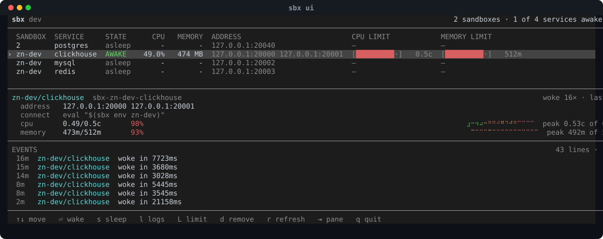
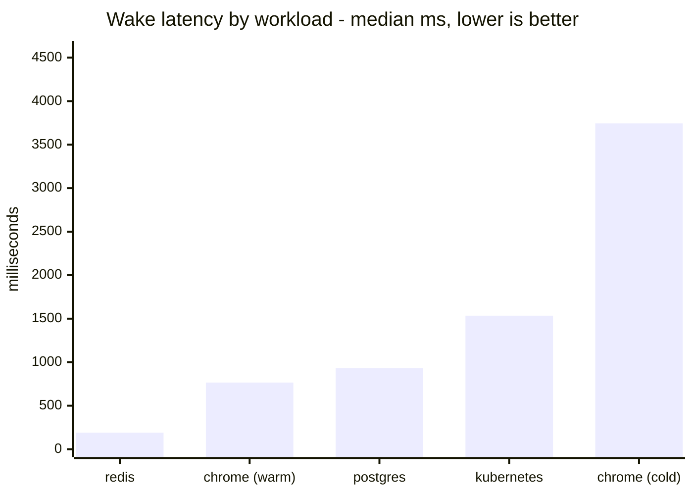
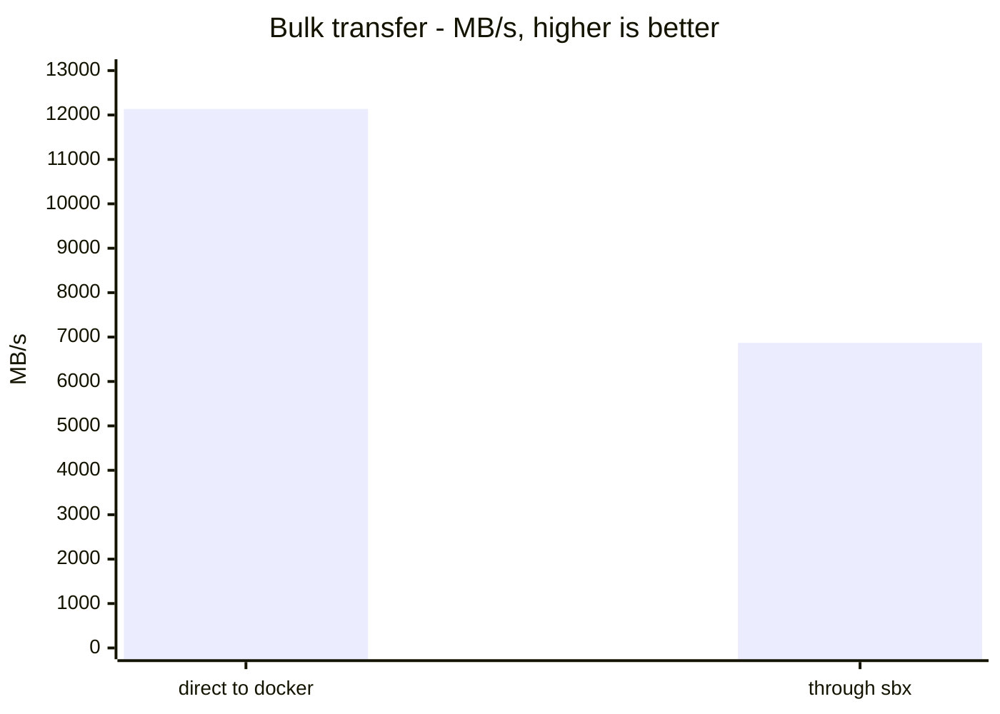
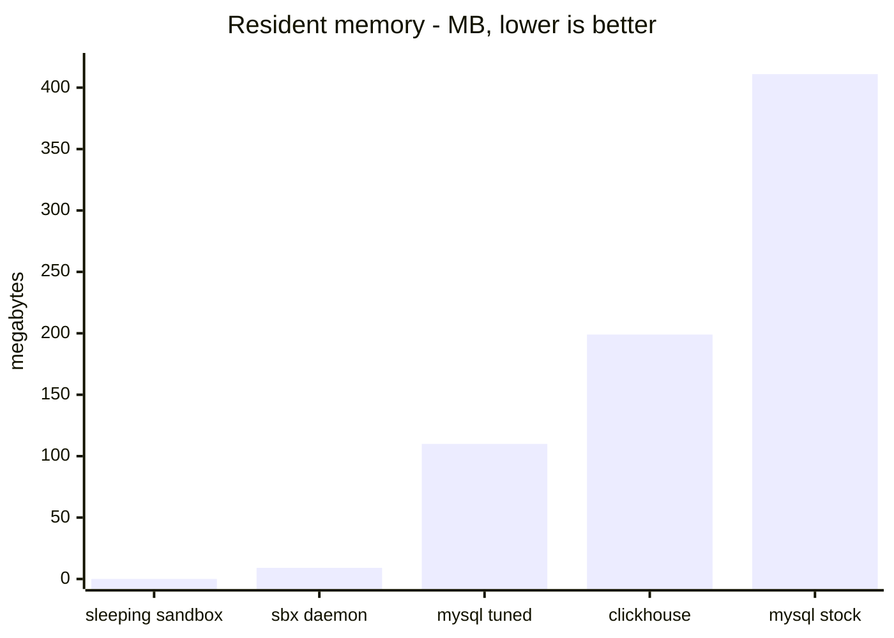

# sbx

[](https://github.com/aryanmehrotra/sbx/actions/workflows/ci.yaml)
[](go.mod)
[](go.mod)
[](LICENSE)

**Give every branch, task or AI agent its own real Postgres, Redis or browser — one that
costs 0 B of memory while idle and wakes itself the moment anything connects.**

No shared dev database one bad migration breaks for everyone. No `docker compose` stack per
branch eating RAM. No `sbx start` to remember: **opening a socket is the only signal**, so
`psql`, a connection pool, Playwright and a test runner all wake it without knowing sbx
exists. Idle, it sleeps to **0 B**; the first connection is *held*, not refused — 191 ms for
redis, ~1 s for postgres. One static Go binary, zero dependencies.



<sub>Recorded from a real run by [`scripts/demo.sh`](scripts/demo.sh) — the wake shown is whatever that machine did at that moment, not the benchmark median.</sub>

```sh
sbx serve --idle 5m &                          # once per machine, not per sandbox
sbx create my-branch --template postgres       # 492 ms once the image is local
eval "$(sbx env my-branch)"                     # it remembers what it was made from
psql -U app -d app                              # this wakes it
```

---

## What it's for

Five situations. They differ mostly in *who types the commands* — the tool is the same.
→ [USE-CASES.md](docs/USE-CASES.md) for the *why* of each, with numbers.

| | the problem | what sbx does |
|---|---|---|
| **Branches** | one shared database, so a migration on one branch is a migration on all — and a stack per branch costs full memory forever | a sandbox per branch; the ones nobody queried cost **0 B** |
| **Agents** | a task needs a workspace that dies with it, and its clients — `psql`, a pool, a test runner — cannot call an SDK to wake anything | shell commands are the whole integration; `--shell json` to parse, `sbx add` for a service the spec never declared |
| **Fan-out** | the expensive part of a sandbox-per-task is not the container, it's the data | seed once, `sbx snapshot`, then `sbx fork` as many as you want |
| **CI** | jobs wait longer for a stack than they spend testing | `sbx ready` blocks until genuinely serving; a warm runner reuses migrated state |
| **A small team** | per-branch envs without buying a platform | the same binary on a box you own, plus `sbx url` for a link that wakes on open |

---

## Features

**Core**
| | |
|---|---|
| Wakes on any TCP connection | no SDK or client library — anything with a socket |
| Sleeps to 0 B | stopped container, volume intact; idle costs no memory |
| Holds the first connection | waits rather than refusing — **5/5 measured**; a refusing rival scores 0/5 |
| One static binary | zero non-stdlib deps, CI-gated. macOS · Linux · FreeBSD, amd64 · arm64; Windows via WSL2 |
| One committed file | `sandbox.json` says what a branch needs → [SPEC](docs/SPEC.md) |

**Data & builds**
| | |
|---|---|
| Snapshot & fork | save every service's data, fork as many sandboxes from it as you want |
| Checkpoint & resume | save memory + processes and bring them back (CRIU; Linux + experimental docker) |
| Ephemeral runs | `sbx with … -- <cmd>` — created, run, always torn down; fixtures for a test |
| Builds your image | `build:` instead of `image:`, cached by content hash |
| Templates built in | `--template postgres` works with nothing on disk, pinned by digest |
| Your own commands | `mounts` + `sbx exec` = a shell in your code that sleeps too |

**Limits & isolation**
| | |
|---|---|
| Per-service limits | `cpu`, `memory`, `gpus` — a laptop running twenty sandboxes needs a ceiling |
| Egress deny | nothing routed leaves; still reachable and wakeable |
| Isolation tiers | `--isolation gvisor\|kata`, refused with a reason where absent |
| Ordering & secrets | `depends_on` for order, `${VAR}` so a spec names a secret without holding it |

**Anywhere, and driven**
| | |
|---|---|
| Two runtimes | same spec on docker or kubernetes; `sbx doctor` says what this host can do |
| Deploy anywhere | `sbx pack` + `sbx connect` turn a one-port platform back into local ports |
| Live dashboard | `sbx ui` — every sandbox's cpu/memory vs its limit, and a trace of where it's been |
| Drive a deployment | `sbx ui --connect <url>` — wake, sleep, limit, remove, logs, `f` to port-forward here |
| Reads as well as prints | `--json` on `list`, `doctor`, `history`, `env` → [AGENTS](docs/AGENTS.md) |
| History & audit | `sbx history` records changes and wakes, secrets redacted; reads a file, works when docker doesn't |

**Two runtimes, not the same capabilities.** The spec is one file and the everyday commands are
identical on docker and kubernetes; the capabilities are not. Locally a Docker-compatible runtime
is a prerequisite (Docker Desktop, Colima, Rancher Desktop or rootless podman) — and on macOS or
Windows that runtime is a Linux VM, because a Linux container *is* a set of Linux kernel features.
Where a capability is missing it is refused with a reason, never approximated; `sbx doctor` says
what this host can do. [Full table](docs/COMPARISON.md#same-spec-two-runtimes--and-not-the-same-capabilities); the short version:

| | docker | k8s | |
|---|:---:|:---:|---|
| wake · sleep to 0 B · `list` `env` `logs` `exec` `cp` `rm` `ready` | ✅ | ✅ | identical on both |
| **cpu / memory limits** | ✅ | ⚠️ | docker adjusts in place; a cluster patches the Deployment, **rolling the pod**, and needs rights the in-cluster activator deliberately lacks |
| **removing a limit** | ❌ | ✅ | docker reads a zero as "leave unchanged", so a container keeps its ceiling until recreated |
| **cpu / memory usage** | ✅ | ❌ | a cluster needs metrics-server; rows read `n/a` rather than pretend |
| `gpus` · `snapshot`/`fork` · `gc` · `build:` · `prewarm` · `egress:"deny"` · `sbx url` | ✅ | ❌ | each refused in a cluster with a reason — the answers there are a device plugin, a CSI snapshot, a NetworkPolicy, an Ingress |

---

## The dashboard

`sbx ui` — the fleet, what each service uses against what it's allowed, and where it's been.
Recorded by [`scripts/ui-shot.sh`](scripts/ui-shot.sh), not drawn, so a renamed column can't drift.



Bars and traces are scaled to each service's own ceiling, so height means fullness, and every
point is coloured by what was happening when it was drawn. A service with no limit is scaled and
coloured against its own peak instead. `L` sets a limit without leaving the dashboard, and
**every address is a link** — iTerm2, WezTerm, Kitty, GNOME Terminal and Windows Terminal all
open one on cmd- or ctrl-click.

---

## Install & use

```sh
brew install aryanmehrotra/tap/sbx
# or: curl -fsSL https://raw.githubusercontent.com/aryanmehrotra/sbx/main/scripts/install.sh | sh
# or: go install github.com/aryanmehrotra/sbx@latest
```

Run the daemon once — it owns the ports `sbx env` hands out. [`deploy/`](deploy/) has a launchd
plist and a systemd unit, both running as you, not root. Check the machine, prove the cycle (~9 s
once images are local):

```sh
sbx doctor       # what this host can and cannot do
sbx selftest     # create, sleep to zero, wake on a socket, data intact
```

**A branch** — switch away and it sleeps; switch back and the first query wakes it:
```sh
sbx create feature-x                  # reads ./sandbox.json — `sbx init` writes one
eval "$(sbx env feature-x)"           # DATABASE_PORT=20002, REDIS_PORT=20003...
npm test                              # your tooling, unchanged
```

**An agent** — the connection *is* the wake signal; add `"egress":"deny"` for code you didn't write:
```sh
sbx create task-4711 --template postgres          # nothing on disk needed
sbx env task-4711 --shell json                    # {"DATABASE_HOST":"127.0.0.1", ...}
sbx add task-4711 cache --image redis:7-alpine --port 6379 --health 'redis-cli ping'
```

**One seeded database, many agents** — a write in one is invisible to the others:
```sh
sbx exec main postgres psql -U app -d app -f /tmp/schema.sql   # seed once
sbx snapshot main golden
sbx fork golden agent-1                                        # as many as you want
```

**CI** — `sbx prewarm` moves the image pull into a cacheable step:
```sh
sbx serve --idle 30m &
sbx create "$BRANCH" && sbx ready "$BRANCH"   # blocks until actually serving
eval "$(sbx env "$BRANCH")" && ./run-tests.sh
```

**On Kubernetes** — same spec, same commands, `--provider kubernetes`. Services become
Deployments; [`deploy/activator.yaml`](deploy/activator.yaml) plays the daemon's part. `build:`
and `egress:"deny"` are refused there, not approximated.

### Every command

| | |
|---|---|
| `sbx create` / `rm` | make one from `sandbox.json` or `--template`, destroy it with its data |
| `sbx env` | exports for your tooling — posix, fish, powershell, cmd, **json** |
| `sbx ready` | wake it and block until it's serving — the CI one-liner |
| `sbx wake` / `sleep` | park a sandbox now or bring it back — explicit, for an orchestrator that won't wait on the idle timer |
| `sbx exec [-t]` | run anything inside; `-t` attaches a terminal for a shell or `psql` |
| `sbx logs [-f]` | every service on one structured stdout — the one command that does *not* wake anything |
| `sbx cp` | files in and out (`:` marks the inside path) |
| `sbx add` | drop in a service nobody declared — the agent affordance |
| `sbx url` | a public link that wakes it when opened |
| `sbx snapshot` / `fork` | save every service's data, then make as many sandboxes from it as you want |
| `sbx checkpoint` / `resume` | save memory **and** processes and bring them back — CRIU, Linux + experimental docker; refused elsewhere |
| `sbx with` | create a sandbox, run a command with its env, always remove it — ephemeral fixtures for a test run |
| `sbx init` / `validate` | write the spec · check one without creating anything |
| `sbx prewarm` | pull the images now, so the first create isn't a download |
| `sbx gc` | reclaim volumes whose sandbox is gone; `--snapshots` includes saved states, `--force` deletes |
| `sbx doctor` | what this machine can and cannot do |
| `sbx list` · `sbx ui` | what exists and what's awake · the same, live, with cpu and memory |
| `sbx history` · `sbx templates` | what happened and who did it · the built-in specs |
| `sbx serve` | **the daemon** — owns the ports, does all waking and sleeping; one per machine |
| `sbx selftest` | the whole cycle, on your machine |

Every sandbox command takes `--provider docker|kubernetes`, `--namespace`,
`--isolation container|gvisor|kata` and `--socket`; `SBX_PROVIDER_KIND`, `SBX_NAMESPACE`,
`SBX_ISOLATION` set the defaults and `DOCKER_HOST` is honoured.

---

## How it compares

**Nothing has to call an SDK to wake a sandbox.** A connection pool can't call
`sandbox.connect()`, and neither can `pg_dump`, a migration tool or a test runner someone else
wrote. Fly's proxy and Knative's activator manage wake-on-connect too — Fly's in Fly's cloud,
Knative's HTTP-only. *Any protocol, on your own machine, with no account* is the corner nobody
else is in. And waking is not the hard part; **holding the connection while it wakes** is, because
most clients don't retry a refusal:

| | wakes on | client can be | first attempt served |
|---|---|---|---|
| **sbx** | **any TCP connection** | anything with a socket | **5/5 measured** |
| E2B · Daytona · Modal · Vercel · Cloudflare | an SDK call | only your own code | your code retries |
| Fly Machines | a request through Fly Proxy | anything, incl. TCP | held by the proxy |
| Knative | an HTTP request | HTTP/gRPC/WS only | held by the activator |
| Lazytainer | packets crossing a threshold | anything that **retries** | **0/5 measured** — refused, served 5 s later |

The condensed feature matrix — ● yes · ◐ partial · ○ no. → [COMPARISON.md](docs/COMPARISON.md) for the full 12-row version, every claim sourced or measured:

| | sbx | E2B | Daytona | Modal | Cloudflare | Fly | Neon |
|---|:---:|:---:|:---:|:---:|:---:|:---:|:---:|
| Wakes on a raw socket | ● | ○ | ○ | ○ | ○ | ● | ◐ pg |
| Runs on your laptop | ● | ○ | ○ | ○ | ○ | ○ | ○ |
| Same spec local + cluster | ● | ○ | ○ | ○ | ○ | ○ | ○ |
| Self-hosted, no account | ● | ○ | ◐ | ○ | ○ | ○ | ○ |
| Multiple services, one spec | ● | ○ | ○ | ○ | ○ | ◐ | ○ |
| Zero cost at rest | ● | ◐ | ◐ | ◐ | ◐ | ◐ | ◐ |
| RAM-state snapshot | ◐ | ● | ● | ● | ◐ | ● | n/a |
| VM-grade isolation | ◐ | ● | ◐ | ● | ● | ● | ● |
| Production-proven | ○ | ● | ● | ● | ● | ● | ● |

**Yes, if** your branches share one database; if an agent needs a workspace that dies with the
task; if CI waits longer for a stack than it spends testing. **Probably still something else, if**
you need proven isolation for code you didn't write (sbx has `--isolation kata`, a real microVM,
but it is opt-in and unproven here — E2B, Vercel Sandbox and Modal give it by default), or you
want someone else to operate it (that's Neon). The full, honest breakdown — including where sbx
now *does* have an answer and how far each is proven — is in
[COMPARISON.md](docs/COMPARISON.md#where-sbx-now-has-an-answer--and-where-to-still-use-something-else).

### Honest limits

The wake is paid on `connect`, not on the query — a client that gives up connecting in two seconds
will give up on a cold postgres, so raise its connect timeout. A container shares the host kernel
unless you run `--isolation gvisor` (CI proves it end to end). Egress can be denied but not filtered
by domain. Memory is not restored, so a wake starts processes cold. **This has not been run in
production anywhere outside its own test suite** — what *is* exercised on every push is below.

---

## Benchmarks

Every number was measured by a script in this repo, on the machine named beside it.
→ [BENCHMARKS.md](docs/BENCHMARKS.md) for conditions, distributions and how to re-run each.

**Level 1 — the wake.** What a caller waits for on connect. The workload dominates, not sbx: a
browser is slow because Chrome is slow to start.



**Level 2 — against the field.** Same harness, same machine: a sample counts only on a correct
protocol reply, and the target must be verifiably asleep at t0.


zeropod is faster than it looks and restores RAM, which sbx does not — that row is the one we
lose, measured rather than conceded. Lazytainer's 3286 ms is mostly *refusals*: 0/5 first attempts.

**Level 3 — the steady state.** What every operation pays for the life of the sandbox — note the
units span five orders of magnitude:

| level | direct | through sbx | cost |
|---|---|---|---|
| a request on an open connection | 14.5 µs | 30.1 µs | **+15 µs** |
| opening a new connection | 0.69 ms | 0.79 ms | **+0.1 ms**, inside the noise |
| bulk transfer | 12136 MB/s | 6870 MB/s | **−43%** |

The middle row was **68 ms** until this project measured it: the daemon re-ran the health check
through `docker exec` on every accepted connection, invisible to benchmarks that all measured six
bytes on one connection.



**Level 4 — memory at rest.** The number the whole design exists for.



A sleeping sandbox is 0 B and the volume it already had. The daemon fronting every sandbox on the
machine is 9.1 MB — *corrected from a published 4.5 MB, which was wrong.*

---

## Docs

| | |
|---|---|
| [AGENTS.md](docs/AGENTS.md) | **pointing an agent at sbx** — a block to paste, and the non-obvious bits |
| [SPEC.md](docs/SPEC.md) | every field of `sandbox.json`, and a docker-compose mapping |
| [USE-CASES.md](docs/USE-CASES.md) | seven shapes this fits, and the ones it doesn't |
| [ARCHITECTURE.md](docs/ARCHITECTURE.md) | the pieces, both data paths, addressing |
| [COMPARISON.md](docs/COMPARISON.md) | against E2B, Daytona, Modal, Fly, Neon, Knative, zeropod |
| [BENCHMARKS.md](docs/BENCHMARKS.md) | every number, and the script that produced it |
| [TROUBLESHOOTING.md](docs/TROUBLESHOOTING.md) | what to do about what you're seeing |
| [DECISIONS.md](docs/DECISIONS.md) | why it's shaped this way — mostly things that broke |
| [console/](console/) | metrics, health and a read-only API for a running daemon |
| [CONTRIBUTING.md](CONTRIBUTING.md) · [SECURITY.md](SECURITY.md) | how the tests are arranged · the threat model |

MIT. Issues and patches welcome.
