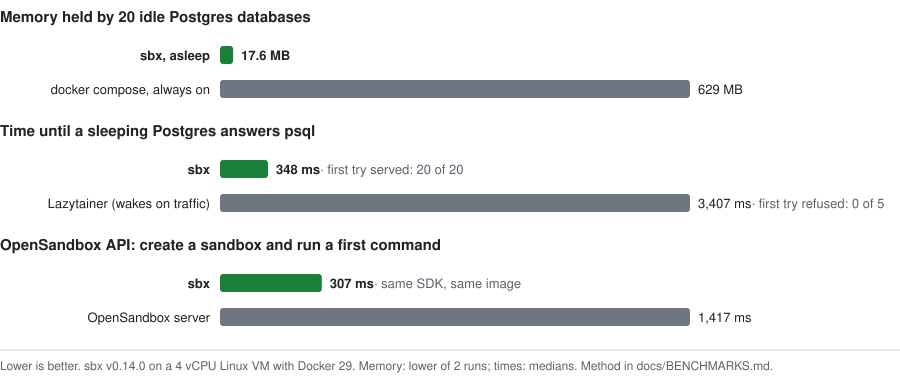

# sbx


[](https://github.com/aryanmehrotra/sbx/actions/workflows/ci.yaml)
[](https://github.com/aryanmehrotra/sbx/releases)
[](go.mod)
[](LICENSE)

sbx gives every branch, pull request or AI agent its own real Postgres, Redis or browser, on
your own machine. Each one sleeps at 0 B of RAM when nobody is using it, and wakes the moment
anything connects to it.

You don't call an SDK to wake it. Point `psql`, a connection pool, Playwright or your test runner
at a sleeping sandbox and sbx holds that first connection open while the service starts, then
hands it over. The client waits a moment and gets an answer, never a refused port.

<picture>
  <source media="(prefers-color-scheme: dark)" srcset="docs/bench-dark.svg">
  
</picture>

- Works with any TCP client: `psql`, connection pools, Playwright, test runners
- One static Go binary with zero dependencies
- The same `sandbox.json` runs on Docker, Kubernetes or Firecracker microVMs

Not to be confused with Docker's own `sbx` CLI (`docker/tap/sbx`).

## Install

```sh
brew install aryanmehrotra/tap/sbx
```

Or `curl -fsSL https://raw.githubusercontent.com/aryanmehrotra/sbx/main/scripts/install.sh | sh`,
or `go install github.com/aryanmehrotra/sbx@latest`. It needs Docker (or a Kubernetes cluster).
Run `sbx doctor` to see what your machine supports.

## Usage

```sh
# Start the daemon once per machine; it owns the ports and sleeps idle sandboxes
sbx serve --idle 5m &

# A Postgres for this branch, and its address in your shell
sbx create my-branch --template postgres
eval "$(sbx env my-branch)"

# Connecting wakes it. There is no start or stop command.
PGPASSWORD=app psql -U app -d app

# Seed once, then give each agent its own copy
sbx snapshot my-branch seeded
sbx fork seeded agent-1

# A throwaway database for one test run, removed even if the tests fail
sbx with test-db --template postgres -- go test ./...

# See everything, live
sbx ui
```

Templates: `postgres`, `browser`, `nginx`, `web-stack` (Postgres and Redis) and `analytics`. For
your own stack, write a `sandbox.json` in the repo ([SPEC.md](docs/SPEC.md)).


## For AI agents

sbx also speaks the [OpenSandbox](https://github.com/opensandbox-group/OpenSandbox) API, an open
standard for agent sandboxes with SDKs in five languages. Those SDKs work against your own machine
unchanged, and OpenSandbox's own test suite runs against sbx in CI.

```sh
sbx serve --osb-addr 127.0.0.1:8080 --osb-pool python:3.11-slim=4 &
export OPEN_SANDBOX_DOMAIN=127.0.0.1:8080 OPEN_SANDBOX_API_KEY="$(cat ~/.sbx/osb/key)"
```

```python
from opensandbox import SandboxSync

sandbox = SandboxSync.create("python:3.11-slim")
print(sandbox.commands.run("python -c 'print(6 * 7)'").logs.stdout[0].text)  # 42
sandbox.destroy()
```

To give Claude Code, Cursor or Codex sandbox tools over MCP, run `claude mcp add sbx -- sbx mcp`
while that daemon is running. Containers share the host's kernel; for code you don't trust, use
`--provider firecracker` to give each sandbox its own kernel. More in
[GUIDES.md](docs/GUIDES.md#ai-agents).

## Documentation

- [Quickstart](docs/QUICKSTART.md): a first sandbox in ten minutes
- [Guides](docs/GUIDES.md): branches, CI, previews, AI agents
- [CLI reference](docs/CLI.md) and [sandbox.json reference](docs/SPEC.md)
- [Troubleshooting](docs/TROUBLESHOOTING.md)
- [How it works](docs/ARCHITECTURE.md), including where it has been tested
- [Benchmarks](docs/BENCHMARKS.md) and [comparison with other tools](docs/COMPARISON.md)
- [Roadmap](docs/ROADMAP.md) and [release notes](docs/release-notes/README.md)
- [Security](SECURITY.md)

## Contributing

Issues and pull requests are welcome. See [CONTRIBUTING.md](CONTRIBUTING.md); coding agents
should read [AGENTS.md](AGENTS.md).

## License

[MIT](LICENSE)
