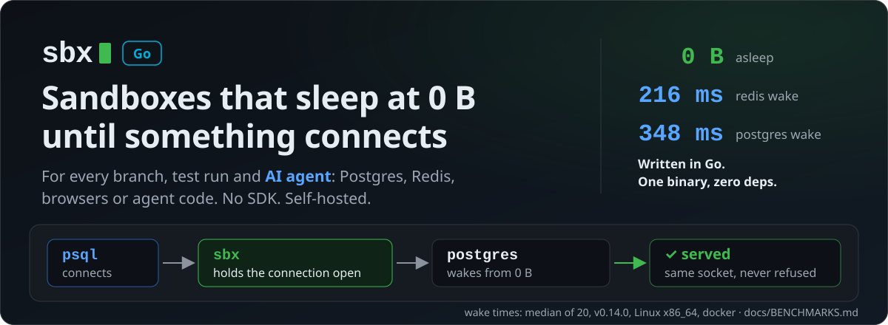
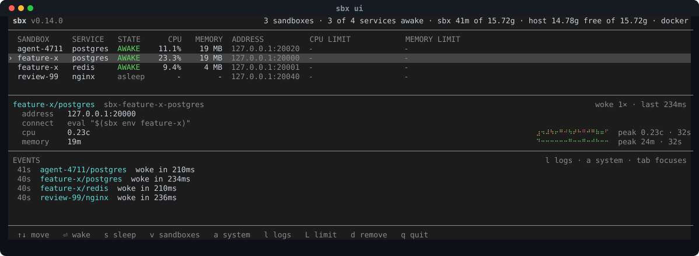

# sbx

[](https://github.com/aryanmehrotra/sbx/actions/workflows/ci.yaml)
[](https://pkg.go.dev/github.com/aryanmehrotra/sbx)
[](https://goreportcard.com/report/github.com/aryanmehrotra/sbx)
[](https://github.com/aryanmehrotra/sbx/releases)
[](go.mod)
[](LICENSE)

**Self-hosted sandboxes for every branch and AI agent — a real Postgres, Redis or browser that
sleeps at 0 B and wakes the moment anything connects. No SDK, no account, one binary.**

<sub>Not Docker Sandboxes' `sbx` CLI (`docker/tap/sbx`), which runs coding agents in microVMs. This is `aryanmehrotra/sbx`.</sub>



## Install

```sh
brew install aryanmehrotra/tap/sbx
# or: curl -fsSL https://raw.githubusercontent.com/aryanmehrotra/sbx/main/scripts/install.sh | sh
# or: go install github.com/aryanmehrotra/sbx@latest
```

One static binary for macOS, Linux and FreeBSD (amd64, arm64); Windows via WSL2. It drives the
Docker engine you already have. `sbx doctor` says what this machine can do.

## A database in three commands

```sh
sbx serve --idle 5m &                          # the daemon: once per machine, it owns the ports
sbx create my-branch --template postgres       # a real Postgres 16 for this branch
eval "$(sbx env my-branch)"                    # sets PGHOST, PGPORT, DATABASE_HOST, DATABASE_PORT
PGPASSWORD=app psql -U app -d app              # connecting wakes it; the call waits, never refuses
```

After five idle minutes it sleeps at 0 B. The next `psql` wakes it again. There is no
`sbx start` and no `sbx stop`. The [10-minute quickstart](docs/QUICKSTART.md) adds snapshots,
forks and an AI agent.

## Why sbx

Most sandboxes wake when *your code* calls their SDK. sbx wakes when *any client* connects.
The daemon holds the first TCP connection open (held, not refused) while the service starts, then
hands over the live socket. So `psql`, a connection pool, Playwright or a test runner someone
else wrote wakes a sleeping sandbox on its first attempt, over any TCP protocol, unmodified.
That runs on your laptop or your cluster, with no account and nothing hosted.

Who it's for:

- **Branch environments.** Twenty branch databases on one laptop; you pay RAM only for the one
  you are using.
- **AI-agent fleets.** Every agent gets its own Postgres, forked from a seeded snapshot and
  deleted with the task. Drive it from the CLI, over MCP, or through the OpenSandbox SDKs.
- **CI fixtures.** `sbx with test-db --template postgres -- go test ./...` creates, runs and
  always removes, even on failure.
- **Self-hosting OpenSandbox.** `sbx serve --osb-addr` speaks OpenSandbox's API, so its Python,
  TypeScript, Go, Java/Kotlin and C# SDKs run against your own machine. Upstream's own e2e suite
  runs against sbx in CI ([test/osb](test/osb/README.md)).



<sub>A real run, recorded by [`scripts/demo.sh`](scripts/demo.sh).</sub>

## How it compares

● yes · ◐ partial or conditional · ○ no · – not checked. Vendor cells checked 2026-09-27 against
each vendor's own pages; sources and the full matrix are in [COMPARISON.md](docs/COMPARISON.md).

| | **sbx** | E2B | Daytona | OpenSandbox | Modal | Fly |
|---|:---:|:---:|:---:|:---:|:---:|:---:|
| Wakes on an unmodified client connection | ● any TCP | ○ SDK | ○ API | ○ API | ○ SDK | ◐ via Fly Proxy; raw TCP needs a dedicated IPv4 |
| Self-hosted, no account | ● MIT | ◐ infra, Apache-2.0 | ◐ AGPL, frozen 2026-06 | ● Apache-2.0 | ○ | ○ |
| Hosted, nothing to run | ○ | ● | ● | ○ | ● | ● |
| Sleep keeps RAM + processes | ● microVM · ○ docker | ● | ◐ VM sandboxes | ● | ◐ alpha | ● suspend |
| Isolation boundary | container · jailed microVM | Firecracker | container; VM optional | container to Firecracker | gVisor | Firecracker |
| SDKs | OpenSandbox's 5 · CLI · MCP | Python, JS | 5 languages | 5 languages | Python, JS, Go | REST API |
| GitHub stars (2026-09-27) | 2 | 13,983 | 71,707 | 15,530 | 519 (client) | 1,713 (flyctl) |

sbx loses on hosting, native SDKs and community. It wins when the client can't call an SDK and
the machine is yours. Docker Sandboxes does a different job: it runs the coding agent itself in
a microVM. Neon wakes on a Postgres connection, hosted, for Postgres only.

## What you can do

**Every day**

| | |
|---|---|
| Start from a template | `--template postgres`, `browser`, `nginx`, `web-stack` (Postgres + Redis), `analytics` |
| Keep one spec per repo | `sandbox.json` declares services, ports, health, seeds → [SPEC](docs/SPEC.md) |
| Hand addresses to any tool | `sbx env` prints posix, fish, powershell, cmd or `--shell json` |
| Block until it really serves | `sbx ready my-branch`, the CI one-liner |
| Run one for a single command | `sbx with` creates, runs, and always removes |

**For AI agents**

| | |
|---|---|
| Seed once, fork per agent | `sbx snapshot` then `sbx fork`; a write in one fork is invisible to the rest |
| Add a service mid-task | `sbx add task cache --image redis:7-alpine --port 6379` |
| Give agents sandbox tools over MCP | `claude mcp add sbx -- sbx mcp`: the 19 tools of OpenSandbox's MCP server |
| Allow only the APIs you name | `egress_allow: ["api.openai.com"]`; change it live with `sbx egress` |
| Keep a box awake while it works | `idle: "never"` for an agent computing inside, with no client traffic |
| Park memory and processes | `sbx checkpoint` / `sbx resume` (CRIU; Linux with podman) |

**Scale and operate**

| | |
|---|---|
| Cap each service | `cpu`, `memory`, `gpus` per service, so one runaway agent can't starve the rest |
| Build your own image | `build:` instead of `image:`, cached by content hash |
| Take the same spec to a cluster | `--provider kubernetes` |
| Give each sandbox its own kernel | `--provider firecracker`: a jailed Firecracker microVM ([status](#platform-status)) |
| Run behind a one-port platform | `sbx pack` to deploy, `sbx connect` to get local ports back |
| Watch and drive the fleet | `sbx ui` locally, `sbx ui --connect <url>` for a deployment |
| Audit changes and wakes | `sbx history`, secrets redacted |

`sbx ui`: every sandbox, what each service uses against its limit, and recent wakes and sleeps.



## Performance

Each figure comes from a script in this repo. Machine, method and how to re-run it are in
[BENCHMARKS.md](docs/BENCHMARKS.md).

| What | Figure | Measured on |
|---|---|---|
| First connection to a sleeping sandbox served | **5/5** (Lazytainer: 0/5) | v0.1.0, loaded M4 laptop, `compare.sh` |
| A sleeping sandbox · the daemon at rest | **0 B** · 9.1 MB RSS | v0.1.0, `ps -o rss` |
| Wake, redis on docker | **191 ms** median, n=20 | v0.1.0; wake path changed in v0.13, not yet re-run |
| Wake, postgres on docker | 931 ms median, n=5 | v0.1.0, host load 5.37, `compare.sh` |
| OpenSandbox create → first command, docker warm pool | **13.7 ms** median, n=10; 472 ms at 100 at once | v0.10.0, M4, `osb-bench.sh` |
| Same, frozen Firecracker microVM pool | **141 ms** median, n=12 | v0.13.0, CI runner with nested KVM |
| Cost on an open connection | +14 µs per round trip; 7.0 GB/s bulk | v0.8.0, M4, `go test -bench` |

A new connection to an awake sandbox adds about 0.1 ms (v0.1.0). Wake time is mostly the
workload's own startup, which is why Postgres takes longer than Redis.

## Platform status

Every provider takes the same `sandbox.json`. What has actually been run where, at v0.14.0:

| Provider · host | Status |
|---|---|
| docker · Linux | Verified in CI on every change: selftest, concurrent e2e, OpenSandbox conformance |
| docker · macOS (colima, Docker Desktop) | Unit tests in CI daily; the laptop benchmarks run here (M4, colima) |
| docker · Windows | Through WSL2 only |
| docker `--isolation gvisor` | Verified in CI (the `isolation` job) |
| kubernetes | Run on minikube for benchmarks; unit-tested; not in CI |
| kubernetes `--isolation firecracker` (kata-fc) | Unit-tested; not yet run on a cluster with kata-fc |
| firecracker · Linux with `/dev/kvm` | Verified in CI (`microvm` job, nested KVM), jailer on |
| firecracker · M3+ Mac, macOS 15+, via helper VM | Run end to end with colima at a v0.11 commit; lima unit-tested only |
| firecracker · Mac, OpenSandbox API through the helper VM | Unit-tested with fakes; not yet run on a Mac |
| firecracker · Windows 11, via a WSL2 helper VM | Built and unit-tested; not yet run on a Windows host |
| `sbx checkpoint` / `resume` | Linux with a podman runtime only; not in CI |

`sbx doctor` reports which of these applies to the machine you're on.

## Commands

| | |
|---|---|
| `sbx serve` | the daemon: owns the ports, wakes and sleeps everything; one per machine |
| `sbx create` · `rm` | make a sandbox from `sandbox.json` or `--template`; delete it and its data |
| `sbx env` · `ready` · `with` | its addresses; block until serving; a create-run-remove fixture |
| `sbx list` · `ui` · `logs` · `history` | what exists and what's awake, live, its output, what changed |
| `sbx exec` · `cp` · `add` · `url` | run inside it, copy files, add a service, a public link that wakes it |
| `sbx snapshot` · `fork` · `checkpoint` · `resume` | save and copy state |
| `sbx egress` · `mcp` · `fc` | live network policy; an MCP server; the microVM helper |
| `sbx doctor` · `selftest` · `version` | what works here; prove the full cycle (~9 s); the version |

`sbx help` lists them all, `sbx <command> --help` explains one, and [CLI.md](docs/CLI.md) is
the full reference: every command, `serve` flag and `SBX_*` variable, including the gated
previews that `sbx features` lists.

## Docs

Start at the [docs index](docs/README.md). The pages most people need:

| | |
|---|---|
| [QUICKSTART.md](docs/QUICKSTART.md) | ten minutes from install to a woken Postgres, a fork, and an AI agent |
| [AI-AGENTS.md](docs/AI-AGENTS.md) | a block to paste into your agent's instructions, MCP setup, recipes |
| [USE-CASES.md](docs/USE-CASES.md) | the shapes this fits, with the commands |
| [SPEC.md](docs/SPEC.md) | every `sandbox.json` field, and a docker-compose mapping |
| [CLI.md](docs/CLI.md) | every command, flag and environment variable |
| [TROUBLESHOOTING.md](docs/TROUBLESHOOTING.md) | what to do about what you're seeing |

## Contributing

Issues and pull requests are welcome. [CONTRIBUTING.md](CONTRIBUTING.md) explains how the tests
are arranged; [AGENTS.md](AGENTS.md) holds the rules for humans and coding agents editing this
repo. Report vulnerabilities as described in [SECURITY.md](SECURITY.md).

MIT licensed. See [LICENSE](LICENSE).
