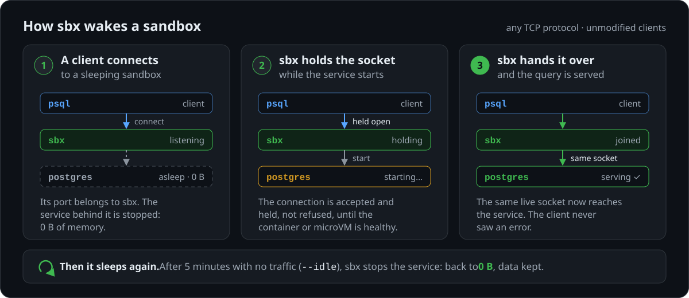
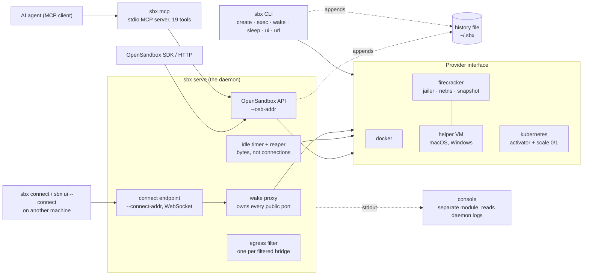

# Architecture

How sbx's pieces fit together, for contributors and for anyone deciding whether to trust it.
Why each choice was made is in [DECISIONS.md](DECISIONS.md); the threat model is in
[SECURITY.md](../SECURITY.md).



## Overview



- The `sbx` CLI reads `sandbox.json`, drives a provider directly and logs to the history file.
- `sbx serve` is the one long-running process. It owns the public ports, wakes a sandbox on the
  first byte and sleeps it after `--idle`. It also runs the egress filters and, when asked, the
  OpenSandbox API and the `sbx connect` endpoint.
- Providers do the work: docker containers, kubernetes Deployments scaled 0↔1, or Firecracker
  microVMs whose sleep is a snapshot.
- `sbx mcp` is a stdio client of the OpenSandbox API. `sbx ui` is a terminal dashboard. The
  console is a separate Go module, so the root module keeps zero dependencies.

## Platform status

Every provider takes the same `sandbox.json`. What has actually been run where, at v0.15.1:

| Provider · host | Status |
|---|---|
| docker · Linux | **verified in CI** on every change (`selftest`, `usecases`, `osb-conformance`) |
| docker · macOS (colima, Docker Desktop) | **unit-tested** in CI on every PR and daily; **run by hand** on an M4 with colima (benchmarks) |
| docker · Windows | inside WSL2 only; **not yet run end to end** on a Windows host |
| docker `--isolation gvisor` | **verified in CI** (`isolation` job) |
| docker `--isolation kata` | **run by hand** on a nested VM host at v0.15.1: the container got no network and could not restart. `sbx doctor` checks registration only |
| kubernetes | **unit-tested**; **run by hand** on minikube (benchmarks); not in CI |
| kubernetes `--isolation firecracker` (kata-fc) | **unit-tested**; **not yet run end to end** on a cluster |
| firecracker · Linux with `/dev/kvm` | **verified in CI** (`microvm` job, nested KVM, jailer on) |
| firecracker · M3+ Mac, macOS 15+, via helper VM | **run by hand** with colima on an M4 (v0.11); lima **unit-tested** |
| firecracker · Mac, OpenSandbox API through the helper VM | **unit-tested**; **not yet run end to end** on a Mac |
| firecracker · Windows 11, via a WSL2 helper VM | **unit-tested**; **not yet run end to end** on a Windows host |
| `sbx checkpoint` / `resume` | **run by hand** on Linux with podman (v0.7.0); not in CI |

`sbx doctor` reports which of these applies to the machine you're on.

## Terms

| Term | Meaning |
|---|---|
| sandbox | One named, isolated copy of a project's services, for one branch, task or agent |
| service | One process inside a sandbox, such as its Postgres or its Redis, with its own port |
| snapshot / fork | Save every service's data once, then make as many independent sandboxes from it as you like |
| preview feature | A feature that is off until you turn it on with `sbx features`, because it may still change |
| E2B, Daytona | Hosted services that rent AI agents a sandbox to run code in; see [COMPARISON](COMPARISON.md) |
| spec | The `sandbox.json` file that declares a sandbox's services ([SPEC](SPEC.md)) |
| template | A built-in spec you pick with `--template`, such as `postgres` |
| daemon | `sbx serve`: the one long-running process that holds the ports and wakes and sleeps sandboxes |
| provider | What runs the sandboxes: `docker` (default), `kubernetes` or `firecracker` |
| sleep | Stop an idle service so it uses no memory or CPU; on a microVM, its memory is saved to disk as a snapshot |
| wake | Start a sleeping service because something connected; that first connection waits, it is not refused |
| freeze | Pause a service with its memory kept, so it resumes in ~34 ms instead of restarting ([v0.14.0, Linux x86_64](BENCHMARKS.md#sbx-by-itself)) |
| OpenSandbox | An open-source API standard for AI-agent sandboxes, with SDKs in 5 languages |
| MCP | Model Context Protocol: the standard way AI assistants such as Claude or Cursor call outside tools |
| microVM | A small virtual machine with its own kernel, so a sandbox does not share the host's |
| Firecracker | The open-source microVM monitor AWS built for Lambda; sbx's `firecracker` provider uses it |
| helper VM | A Linux VM (lima or colima) sbx starts on a Mac or Windows machine so microVMs can run there |
| gVisor | A runtime that runs containers on its own user-space kernel instead of the host's |
| Kata | Kata Containers: a runtime that runs each container inside its own lightweight VM |
| CRIU | A Linux tool that saves a running process's memory to disk and restores it later |
| warm pool | Sandboxes started ahead of time, so a create is answered at once |
| pause (API) | An OpenSandbox API `pause`: a freeze that incoming traffic does not undo; only a resume does |
| execd | The small agent sbx runs inside an API sandbox to execute commands and file operations |
| jailer | Firecracker's launcher that locks each microVM's process into its own directory as an unprivileged user |
| netns | A network namespace: a private copy of the network stack for one process |
| activator | On kubernetes, a pod running `sbx serve` that takes connections for a sandbox at zero replicas and scales it up |
| egress | Traffic leaving a sandbox for the network; sbx can limit it to the hosts you name |
| egress filter | The proxy that decides which outside hosts a sandbox's traffic may reach |

## The rule

> Nothing may start or stop a sandbox except the thing that can see demand.

Anything else that can start one eventually leaves one running, and two components disagree about
who owns it.

The OpenSandbox API is a lifecycle API, so it bends the rule. Each exception is an explicit request
from the caller or bounded by the daemon:

| What starts or stops a sandbox | Why it is allowed | Who owns it next |
|---|---|---|
| API `pause` | the caller asked for a freeze that traffic must not undo; the daemon holds it | the hold, until `resume` |
| API `resume` | the caller asked; it releases the hold and thaws | the daemon |
| API `DELETE`, the expiry reaper | the sandbox's `timeout` is the caller's; removal is not a start | nobody: it is gone |
| API `POST .../snapshots` | `docker commit` pauses a running container for the copy, then thaws it | the daemon; a stopped one is committed without starting |
| warm-pool members | created running before any caller, and pinned: the reaper skips them until claimed | the daemon, from the claim; the idle clock starts then |
| `create` (CLI or API) | a new container is started once, to be made | the daemon, from its first idle check |
| `sbx wake` / `sbx sleep`, the dashboard's `s`, connect-endpoint control | a one-transition override; the idle policy is untouched | the daemon, from its next connection or tick |

Anything else that starts or stops a container is a bug.

## Wake and sleep

Something has to answer while nothing is running. On docker, each service gets two ports: a
public one that `sbx serve` owns, and a backing one that docker publishes only while the service
runs.

```
  client ──▶ :20002 (public, sbx serve)
                 │  serving? (Probe) ── no ──▶ docker start, wait for health
                 ▼
             :30002 (backing, docker; gone while asleep) ──▶ postgres :5432
  bytes are spliced both ways once it answers
```

```
            a connection / exec / URL hit
   ASLEEP (0 B) ─────────────────────────────▶ AWAKE
        ◀──────── no bytes for --idle ─────────
   (reaped every shortest idle/3, 1-30 s)
   the volume or PVC persists across both
   guard: a sandbox cannot sleep until seen serving once
```

- Idle is measured in bytes, not connections, because a pool holds sockets open forever.
- The guard exists because the activator once scaled a sandbox to zero 39 seconds into its own
  creation.
- The proxy splices bytes and parses no protocol, so it works for anything over TCP.

### Kubernetes: the activator

A Service that selects the workload cannot answer at zero replicas, so there are two. The client
Service (`sbx-x-pg:5432`) selects the activator, which scales the Deployment 0 → 1 and dials the
workload Service (`sbx-x-pg-app:5432`). The PVC survives sleep. The activator's RBAC can scale a
Deployment, not create or destroy one.

## Addressing

```
   sandbox.json services (alphabetical, stable)
   ├── clickhouse :9000 :8123 ──▶ ordinal 0, 1
   ├── postgres   :5432       ──▶ ordinal 2
   └── redis      :6379       ──▶ ordinal 3

   slot (allocated from labels, not hashed)
   public  = 20000 + slot×20 + ordinal
   backing = 30000 + slot×20 + ordinal
```

- Slots are allocated, up to 128 (`docker_provider.go`). Hashing names into 60 slots collided on
  the first six branch names tried.
- Docker labels are the registry, so there is no state file to drift from reality.
- Optional services still reserve ordinals, so adding one later never moves another's port.
- None of this applies in a cluster: a pod has its own address, so Postgres is `:5432` on a name.

## The same spec, any backend

`sbx create my-branch` takes the same spec with `--provider kubernetes` or `--provider firecracker`
(one microVM per service). Nothing in `sandbox.json` names a backend.

| | docker | kubernetes | firecracker |
|---|---|---|---|
| address | `127.0.0.1:20002` | `sbx-x-pg.sbx.svc:5432` | `127.0.0.1:20002`, upstream the guest's tap IP |
| wake | `docker start` | scale → 1 | snapshot load + resume |
| sleep | `docker stop` | scale → 0 | snapshot (Diff) + kill the VMM |
| health | HEALTHCHECK | readinessProbe | the spec's `health` over vsock, at create and after a cold boot; a snapshot wake dials the first port only |
| storage | named volume | PVC | the image's ext4, shared read-only, under a writable layer per VM |
| isolation | `--runtime` | `runtimeClassName` | a guest kernel, always |

The wake policy does not know which provider it drives. That is why the provider is an interface
and not a flag.

## MicroVM: firecracker

`--provider firecracker` makes each service a Firecracker VM whose sleeping state is a snapshot on
disk. A wake brings memory and running processes back
([DECISIONS: MicroVM](DECISIONS.md#microvm-firecracker)). It runs directly on Linux with
`/dev/kvm`, and on an M3+ Mac (macOS 15+) or Windows 11 through a Linux helper VM
(`internal/fchost`).

Where it runs is one decision, `fchost.HostBackend` (`provider.DecideHost`), used by every command:

```
  fchost.HostBackend ─┬─ direct ──────────── fcProvider (this machine)
                      ├─ helper-vm ───────── HelperVMProvider hook (macOS, Windows)
                      ├─ kata-runtimeclass ─ --provider kubernetes --isolation kata
                      └─ refused ─────────── reason + the one thing to change

  <state>/fc/                              SBX_FC_STATE, default ~/.sbx/fc
    artifacts/firecracker-v1.17.0-<arch>-<sha>/   pinned by sha256
    artifacts/jailer-v1.17.0-<arch>-<sha>/        same release tarball, same sha256
    artifacts/vmlinux-6.18.48-<arch>-<sha>/
    rootfs/<image id>/rootfs.ext4          docker export → mkfs.ext4 -d; root's, 0444, shared
    vms/<hash of ref>/                     0700, one per service
      vm.json api.sock vsock.sock console.log vmm.log firecracker.pid lock
      agent.ext4 (vda, ro)                 /sbx + /init.json
      base.ext4  (vdb, ro)                 hard link to the image's rootfs.ext4
      upper.ext4 (vdc, rw)                 writable layer, sparse, SBX_FC_DISK_SIZE (10G)
      rootfs.ext4 (vdb, rw)                a whole copy instead, with SBX_FC_ROOTFS=copy
      vm.state vm.mem                      the asleep state
      jail/firecracker/sbx-<hash>/root/    the jailed VMM's /, emptied on every launch
    snapshots/<name>/                      sbx snapshot: memory + drives (base linked)
```

| Verb | What happens |
|---|---|
| Create | build or reuse the rootfs, clone it, write the agent drive, cold boot, wait for the first port, Seal, Pause, Full snapshot, kill |
| Start | mark the snapshot invalid (fsync'd), load with `resume_vm`, `vsock_override`, `network_overrides`; Rekey before returning |
| Stop | Seal (retried with a longer bound until confirmed), Pause, snapshot (Diff if restored, else Full), kill, fold the Diff into `vm.mem`, mark valid |
| a Stop whose Seal is never confirmed | Rekey, keep the VM running, report `ErrStillRunning`; the third in a row, or a failed Rekey, kills the VMM |
| a VM that died awake | its snapshot is invalid, so Start cold-boots against the disk |

- The guest's PID 1 is `sbx fc-init`. It mounts the image root, switches root and execs
  `sbx execd --vsock-port 44772 -- <entrypoint>`. Its address comes from the kernel's `ip=`.
- Everything the lifecycle needs from inside the VM is `fc.Guest`: `Dial`, `Seal`, `Rekey`,
  `Available`. On Linux it is `fc.VsockGuest`, so exec, copy, logs and `health` reach execd over
  vsock. A non-Linux build gets `fc.NoGuest`, which still sleeps and wakes but refuses exec, copy,
  `health` and forking by name.
- A sleep or snapshot that fails after a confirmed Seal stops the VM. Its next wake is a cold boot.
- Every fact lives in `vm.json` or the API socket, and every operation takes the VM's flock. So
  `sbx create` can boot a VM that `sbx serve` later sleeps, and the same code runs in the helper VM.
- Every VMM is jailed (`fc.ExecLauncher`): chrooted into `jail/`, as uid
  `900000 + slot*256 + index`, in `<cgroup2>/sbx-fc/<id>`. The provider hands it only paths in
  that root (`fc.View`) and takes back only plain files (`View.Adopt`).
- A jailed VMM joins its VM's network namespace (`/var/run/netns/sbxfc<slot>-<index>`), whose
  tap is bridged to the sandbox's bridge. The host guard fails closed (`fc.IPNetwork`) unless
  `SBX_FC_FIREWALL=unmanaged`. The boundary itself is in [SECURITY.md](../SECURITY.md).

## Egress filter

A sandbox's `egress` field is enforced by a component, `internal/egress`.

- A filtered service sits on a bridge with no NAT. The only host address it reaches is the bridge
  gateway, where the filter listens.
- The filter is an HTTP `CONNECT` and plain-HTTP proxy (`egress.Filter`). `HTTP(S)_PROXY` points
  clients at it. A refused destination gets 403, and no socket is opened to it.
- On native Linux docker and on firecracker it runs inside `sbx serve`. Where the gateway is inside
  an engine's VM (Docker Desktop, colima), it runs as a container on the bridge
  (`internal/provider/egress_container.go`), at the last address of the bridge's subnet, which
  services find through `/etc/hosts`. It refuses the engine's gateways, the default bridge and the
  host behind the VM (`egress.Doors`), whatever the policy says. The daemon lists the engine's
  gateways on every discovery pass and pushes them to each container filter (`PUT /refuse`), so a
  network created later is refused too.
- Every filter carries ports 80 and 443. On docker, `egress_allow` entries written as `host:port`
  add that port; firecracker refuses them. `egress:
  "allow"` uses the same proxy with an open default, so it carries HTTP and HTTPS only.
- `sbx egress` swaps the policy in place without cutting open tunnels.
- A permitted request counts as activity, so an agent that only calls an API stays awake.
- A microVM's filter refuses private ranges and host subnets unless `--vm-egress-allow` names
  them. On kubernetes, `egress: "deny"` is refused up front.

## Remote access: `sbx connect` and `sbx pack`

The daemon's ports stay on loopback. `sbx serve --connect-addr` (needs `SBX_CONNECT_TOKEN`) adds
one HTTP endpoint that carries TCP streams over a WebSocket. sbx implements the tunnel itself
(`internal/wsserver`, `internal/wsclient`, `internal/daemon/connect.go`).

```
   laptop                                    deployment (VM, cluster or PaaS container)
   psql → 127.0.0.1:20002 ──┐              ┌── sbx serve --connect-addr
                       sbx connect ══wss═══╡      wake proxy → the service
                  (same port numbers)      └── needs only one HTTP port
```

- Slots are reused, so every dial names the instance it expects. A mismatch is refused.
- `sbx connect db=https://… cache=https://…` maps several deployments; `--port-offset` avoids a
  local `sbx serve`.
- Wake, sleep, re-limit, remove and logs pass the same token check (`internal/daemon/control.go`).
  `sbx ui --connect` uses them.
- `sbx pack` writes an image for a platform that gives one container and one HTTP port.

Design record: [2026-08-16-sbx-connect-design.md](design/2026-08-16-sbx-connect-design.md).

## MCP server

`sbx mcp` is an MCP server over stdio (`internal/mcp`) with 19 tools. It is a client of the
OpenSandbox API: it dials `--url` (default `$SBX_OSB_URL`, `$OPEN_SANDBOX_DOMAIN`, else
`http://127.0.0.1:8080`) with the API key, so it can do exactly what the API can. It implements the
protocol with no framework. A failing tool answers with `isError`, not a JSON-RPC error, so the
model can correct itself. Usage: [GUIDES.md](GUIDES.md#mcp).

## The OpenSandbox API

`sbx serve --osb-addr` also serves OpenSandbox's lifecycle API. An API sandbox is an ordinary sbx
sandbox named by its id (`osb-` + 12 hex) with one service, woken and idled like any other.

```
   SDK ──▶ osb (sbx serve)                    one API sandbox
           │ create: pull · place execd ────▶ /opt/sbx (execd volume, ro)
           │         · docker run             sbx execd --addr :44772 -- <cmd>
           │ records: ~/.sbx/osb/<id>.json      /command /files /code /pty /proxy
           │ pause ──▶ Freeze + hold          <cmd> is the caller's entrypoint
           │ resume ─▶ Thaw, hold released
           └──▶ daemon: idle = freeze (docker pause, thawed by the next byte);
                        extensions["sbx.idle"]="sleep" stops it to 0 B instead
                 pool:  members wait running and pinned, re-keyed on claim
```

- execd is copied once into a named volume and mounted read-only at `/opt/sbx` in any image
  (`Injector`, docker only). Kubernetes would need an init container, so the API answers 501
  there.
- On a microVM, PID 1 already becomes execd, so the provider declares `RunsAgent` and the API
  skips the volume. An API microVM is born running, its pause is a VM pause, and its snapshot is
  its disk (a fork cold-boots a copy). A `pvc` is an ext4 drive; a `host` volume is a 501.
- Through a helper VM (M3+ Mac, Windows), the API is served by the in-VM daemon on
  `127.0.0.1:22981`, so the jailer, egress filter and host guard are the VM's own. The host half
  (`internal/fchost`) resolves the key as Linux does and reverse-proxies `--osb-addr` (loopback
  only) over the ssh forward.
- The host half serves nothing until the forwarded API answers 401 without the key and 200 with
  it, since containers can reach a Mac loopback port. A mirror binds the in-VM endpoint ports on
  the host; a create or endpoint lookup waits for it (up to 5s).
- Refused on the helper-VM path: `--osb-insecure-no-key`, `--osb-pool`, `--osb-pool-freeze`,
  `SBX_OSB_POOL`. Status: [platform status](#platform-status).
- A held pause and an idle freeze are both `docker pause`. The next byte undoes an idle freeze. A
  held pause reports `Paused`, refuses traffic until `resume`, and survives a daemon restart.
- Freeze-on-idle is the API default because upstream expects a background process to survive
  between requests. `sandbox.json` keeps stop-on-idle.
- The API's state lives in its record file, since docker labels are fixed at create.

## Not built, on purpose

| | Why |
|---|---|
| `sbx start` / `sbx stop` as lifecycle owners | [the rule](#the-rule); `sbx wake` / `sbx sleep` override one transition only |
| A public-URL tunnel | `sbx url` shells out to cloudflared, ngrok or ssh; `sbx connect` is sbx to sbx only |
| Preview URLs in cluster mode | that is an Ingress, which already exists |
| A code-interpreter runtime | execd's `/code` drives the Jupyter an image already runs; sbx ships no kernels |
| Multi-tenant hosting | no accounts, quotas or tenancy ([DECISIONS.md](DECISIONS.md#sbx-is-a-tool-people-run-not-a-service-anyone-offers)); for a kernel per sandbox use `--provider firecracker` |
