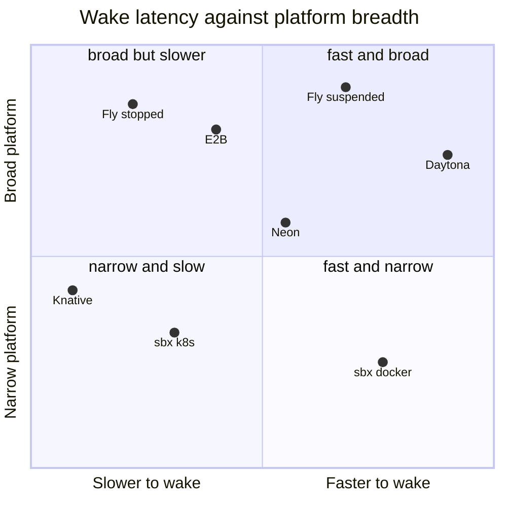
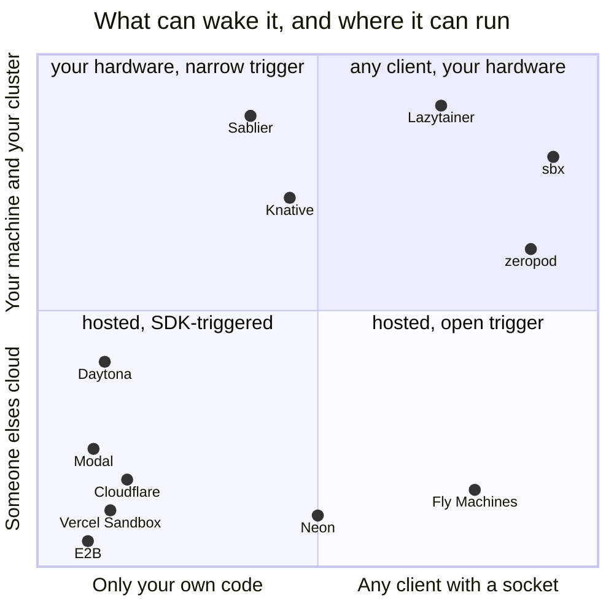

# Compared

> **Short version:** sbx wakes on any TCP connection, with no SDK, on hardware you own. That
> corner is unoccupied. It loses on memory restore (zeropod, E2B), on egress filtering by
> domain, and on being someone else's problem to operate (Neon). Every figure here is measured
> in this repo or quoted from the vendor with a link — never from a competitor's marketing.

## The whole field, one table

● yes · ◐ partial or conditional · ○ no. The rows below the fold break each of these down and
say where the ◐ and ○ are choices rather than gaps.

| | sbx | E2B | Daytona | Modal | Cloudflare | Fly | Neon | Northflank |
|---|:---:|:---:|:---:|:---:|:---:|:---:|:---:|:---:|
| Wakes on a raw socket | ● | ○ | ○ | ○ | ○ | ● | ◐ pg only | ○ |
| Runs on your laptop | ● | ○ | ○ | ○ | ○ | ○ | ○ | ○ |
| Same spec local + cluster | ● | ○ | ○ | ○ | ○ | ○ | ○ | ◐ |
| Self-hosted, no account | ● | ○ | ◐ OSS core | ○ | ○ | ○ | ○ | ◐ BYOC |
| Arbitrary stateful services | ● | ◐ | ● | ◐ | ◐ | ● | ○ pg | ● |
| Multiple services, one spec | ● | ○ | ○ | ○ | ○ | ◐ | ○ | ● |
| Zero cost at rest | ● | ◐ storage | ◐ storage | ◐ storage | ◐ storage | ◐ storage | ◐ storage | ○ |
| RAM-state snapshot | ◐ podman/Linux | ● | ● | ● | ◐ | ● | n/a | ○ |
| VM-grade isolation | ◐ kata | ● | ◐ | ● | ● | ● | ● | ● |
| Public URL per sandbox | ● | ● | ● | ● | ● | ● | n/a | ● |
| GPU | ◐ docker | ◐ | ◐ | ● | ○ | ● | n/a | ● |
| Production-proven | ○ | ● | ● | ● | ● | ● | ● | ● |

**Read the bottom row before the top four.** `Production-proven` is the one still-flat ○, and it
is the one that matters most: every hosted platform here has real users and this does not. The
three ◐ additions (a kata microVM, CRIU checkpoint on Linux, docker GPU passthrough) are opt-in or
experimental, added recently and marked partial for exactly that reason. Whether the trade is
right depends on whether your sandbox runs your own services or someone else's code.

---

## First, two different things are called "sandbox"

The platforms people compare this to mostly aren't doing the same job. The word covers two
products that share almost nothing:

```
   A PLACE TO RUN CODE                    A PLACE TO RUN THE SERVICES
                                          YOUR BRANCH NEEDS
   ───────────────────────────            ───────────────────────────────
   unit    an execution session           unit    a long-lived set of ports
   client  an SDK you call                client  psql, redis-cli, a pool,
   sold on isolation                              Playwright, a test runner
   dies    when the task ends             sold on cost at rest
                                          lives  as long as the branch

   E2B · Daytona · Modal                  sbx · Neon · preview-env platforms
   Vercel Sandbox · Cloudflare
```

**sbx is the right-hand column.** For untrusted model-authored code that needs a kernel boundary,
the left-hand column is what you want, and this is not competing for it — see
[where to use something else](#where-sbx-now-has-an-answer--and-where-to-still-use-something-else).

## The axis that actually separates them

Everybody scales to zero. The question nobody's table asks is **what has to happen to bring it
back**, because that decides who is allowed to be the client.

| | wakes on | so the client can be | runs off-cloud |
|---|---|---|---|
| **sbx** | **any TCP connection** | anything with a socket | **laptop + cluster** |
| E2B | `sandbox.connect()` — an SDK call | only your own code | ✗ hosted |
| Daytona | start/resume API call | only your own code | ✗ hosted |
| Modal | SDK call | only your own code | ✗ hosted |
| Vercel Sandbox | SDK call | only your own code | ✗ hosted |
| Cloudflare Sandbox SDK | SDK call over RPC | only your own code | ✗ hosted |
| Fly Machines | a request through Fly Proxy | anything, incl. TCP services | ✗ their proxy |
| Knative | an HTTP request through the activator | HTTP/gRPC/WebSocket only | ✓ needs a cluster |
| Neon | a Postgres connection | Postgres clients only | ✗ hosted |

A connection pool cannot call `sandbox.connect()`. Neither can `psql`, `pg_dump`, a migration
tool, Playwright over CDP, or a test runner someone else wrote. On any SDK-triggered platform
*something in your code* has to know the sandbox is asleep and wake it first — so every tool that
touches it must be sandbox-aware. Here the socket is the signal, and the tools stay unmodified.

Two get this right and are worth naming: **Fly Proxy** wakes on a real connection and supports TCP;
**Neon** wakes on the Postgres protocol itself. Both are hosted and excellent — the ideas here are
not novel against them. What's different is that this runs on your laptop, no account, any protocol.

## What "asleep" costs, and what it keeps

| | at rest | wake | what survives |
|---|---|---|---|
| **sbx** | **0 B RAM**, and the volume it had | **191 ms** redis · 931 ms postgres · 1534 ms k8s | disk; processes cold-start |
| E2B | storage only | **~1 s** | **disk + RAM + running processes** |
| Daytona | storage only | *no wake figure published* | disk, persistent volume |
| Fly (suspended) | storage only | a few hundred ms | RAM snapshot |
| Fly (stopped) | storage only | ~2 s+ | disk |
| Neon | storage only | a few hundred ms | Postgres data |
| Knative | 0 pods | pod schedule, seconds | volume, if attached |

**The honest weakness, plainly.** E2B pauses to a memory snapshot — loaded variables and running
processes come back as they were, at ~4 s per GiB to pause and ~1 s to resume. sbx does not
snapshot RAM: a sleeping sandbox is a stopped container with its volume intact, so a wake is a
**cold process start against warm data** (Postgres replays its WAL and comes up; it doesn't resume
mid-transaction). That's a worse guarantee — and it's why sleeping costs nothing to *enter*: no
RAM image to write at 4 s/GiB, no meter on the disk it keeps. For a database on a branch,
disk-warm is the state that matters. For an agent's half-finished REPL it isn't, and E2B wins.

## Where this sits

Two charts, because one flatters us and one doesn't, and showing only the first is the kind of
comparison this file exists to avoid.

### 1 · Speed against breadth — the chart everyone draws



**We are bottom-right — fast, and narrow — and that is the correct place for us.** The breadth
score deliberately counts eight things we mostly *don't* do, or do only partially (a kata VM, CRIU on Linux, GPU passthrough,
arbitrary stateful services, a public URL, someone else operating it, multi-tenant security,
production-proven); scored on rows we'd have picked, every one of these charts would put us
top-right, which is exactly why the score doesn't use them.

| | wake, ms | source | breadth /8 |
|---|---|---|---|
| Daytona | *none published* | — | 6.5 |
| **sbx** docker | **191** | `scripts/bench.sh 20`, this repo | **2** |
| Fly, suspended | a few hundred | [vendor][fly] | 7.5 |
| Neon | a few hundred | [vendor][neon] | 4.8 |
| E2B | ~1000 | [vendor][e2b] | 7 |
| **sbx** kubernetes | **1534** | `scripts/bench.sh`, minikube | 2.5 |
| Fly, stopped | ~2000+ | [vendor][fly] | 7.5 |
| Knative | seconds, pod schedule | — | 4 |

**The x-axis is not a fair race and is log-scaled.** Ours is loopback on an idle laptop; theirs
is a multi-tenant fleet across a network, and E2B's second restores a RAM image while our 191 ms
starts a process. [BENCHMARKS.md](BENCHMARKS.md#against-other-platforms) lists all four reasons,
all favouring us. Modal and Cloudflare are absent — no vendor-documented wake figure, and a blank
beats a guess.

### 2 · The chart that explains why this exists

Same platforms, two axes that are structural rather than measured — so no hardware, network or
region can flatter anybody.



The hosted platforms are all bottom-left, and the top-right is not ours alone: Fly is far right
(its proxy wakes on a real connection, but it's their proxy in their cloud), Knative is high (you
run it, but HTTP-only), Neon sits mid-x (the Postgres wire protocol *is* the trigger — the right
idea, one protocol wide). The three neighbours in that corner are the prior art, covered next.

## The closest prior art

Not the hosted platforms — three self-hosted Go projects that solve the same problem, and the ones
to read before this one. Two predate it.

**zeropod** · [ctrox/zeropod](https://github.com/ctrox/zeropod) · 939★ · **measured.** A
containerd shim: eBPF watches TCP activity, CRIU checkpoints the container to disk after idle, and
an activator **restores on the first connection in tens to a few hundred ms** — with memory, open
files and processes intact. Same mechanism as ours, one layer down, and on RAM it beats us
outright: what we restore is a disk; what it restores is the process. Measured, not trusted:
**272 ms median, n=4, 4/4 first attempts served** (`scripts/zeropod-probe.sh`, CI). It costs more
because it *replaces your container runtime* — a containerd shim, CRIU and eBPF on every node,
plus a cluster; its README calls arm64 in a Linux VM on macOS "somewhat flaky", i.e. Docker
Desktop on Apple Silicon. A cluster technology; this is a userspace binary you run as yourself.

**Sablier** · [sablierapp/sablier](https://github.com/sablierapp/sablier) · 2,888★. The most
popular and the most different: an API server that reverse proxies (Traefik, Caddy, Nginx, Envoy,
APISIX, Istio) call through middleware, over five providers (docker, swarm, podman, kubernetes,
Proxmox LXC), with a blocking strategy or a themed waiting page. **It is HTTP-only** — the wake is
a middleware hook on an HTTP request, so nothing wakes `psql` without a proxy that speaks the
Postgres wire protocol, which is the problem it declines to solve. Steady-state overhead is
~1.5–2 ms/request vs our ~15 µs, because a proxy that parses is not a proxy that splices. Worth
stealing: the waiting page — `sbx url` currently offers only a spinner.

**Lazytainer** · [vmorganp/Lazytainer](https://github.com/vmorganp/Lazytainer) · 754★. Counts
packets on an interface and stops containers below a threshold (default 30). Protocol-agnostic
like ours and closest in spirit — but containers must be labelled into a group **and have their
traffic routed through the Lazytainer container**, so it owns your networking; a packet count
means a chatty health check keeps things awake and a quiet session looks idle. No spec file, no
per-service readiness, no exports.

| | wakes on any TCP | no runtime replacement | laptop-first | per-service spec | restores RAM |
|---|---|---|---|---|---|
| **sbx** | ● | ● | ● | ● | ○ |
| zeropod | ● | ○ shim + CRIU + eBPF | ○ | ○ | ● |
| Lazytainer | ● | ◐ owns networking | ● | ○ | ○ |
| Sablier | ○ HTTP only | ● | ● | ◐ labels | ○ |

The honest sentence is not "nobody does this." It's: **zeropod does it deeper and needs a cluster;
Lazytainer does it cruder and needs your network; Sablier does it for HTTP and is the one most
people actually run.** What's unoccupied is the intersection — arbitrary TCP, no runtime to
replace, a committed spec file, and the same binary on a laptop and in a cluster.

## What we've measured, and what we've only read

Everything above about the three rivals is from their docs and source. `scripts/compare.sh` tries
to measure them on one machine; as of 2026-08-15, this is that attempt:

| claim | status |
|---|---|
| Sablier is HTTP-only — cannot wake `psql` | **measured**: reports `N/A` for the postgres target, by design |
| Sablier's ~1.5–2 ms overhead | **unmeasured here** — its Traefik middleware would not engage under any config tried |
| zeropod restores in tens–hundreds of ms, RAM intact | **measured** — 272 ms median, n=4, 4/4 served, kind cluster in CI. Claim holds |
| Lazytainer wakes on any TCP | **measured** — it does, but never holds: attempts 1–5 refused, served on the 6th 5150 ms later. 0/5 vs sbx's 5/5 |
| sbx wakes on raw TCP (postgres) | **measured** — 5/5 first attempts, median 931 ms |
| sbx's proxy tax | **measured** — 33 µs/req over a same-container floor, ±21 µs; benchstat's ~15 µs by another method |
| sbx drives a remote docker host | **measured** — `DOCKER_HOST=tcp://` creates and lists over the network; `https://` refused (no client certs), so the supported shape is a trusted network |
| the sbx daemon is 4.5 MB | **measured and wrong** — 9.1 MB at rest. Corrected in BENCHMARKS.md, the README and the architecture diagram |
| Neon wakes in 300–800 ms | **quoted and wrong** — the [vendor][neon] says "a few hundred milliseconds", no range. The 300–800 was ours, attributed to them. Corrected |
| an E2B fork takes 5–30 ms | **quoted and wrong** — [their page][e2b-fork] gives no figure; a fork carries files, processes and memory, pause scaling with disk changes. Corrected |
| E2B fans out from a snapshot "in tens of ms" | **quoted and wrong** — E2B publishes ~1 s to resume and no fan-out figure. Off ~20×; survived the correction above by ninety lines. Corrected here and in a Go comment |
| Daytona wakes in ~90 ms p99 | **quoted and wrong twice** — Daytona advertises a *cold start* "under 90ms", no percentile, no wake figure. The row is now blank, same rule that keeps Modal and Cloudflare out |
| E2B scales to zero after 5 min by default | **quoted and wrong** — timeout is 5 min and `onTimeout` defaults to **kill**; auto-pause is opt-in. Credited a competitor with a default they don't have |
| the Fly citation | **a 404** — both Fly figures were right and the link was dead, which for a "check it yourself" document is the same failure as inventing them. `scripts/lint-docs.sh` now fetches every external URL |

**Two of those are worse than being wrong about ourselves.** A number invented and hung on a
vendor's link is the one thing a reader can't check — exactly what this document claims never to
do — and both ran in directions that flattered this table (a fabricated 800 ms put Neon behind us;
a fabricated 5 ms put E2B's fork where no vendor claimed). They were found by a review that opened
the linked pages, the check that should have come first. The real fork difference survives and is
sharper than the number was: an E2B fork is copy-on-write, O(1) in dataset size; `sbx fork` copies
the volume byte-for-byte, O(n). For an 8 GB fixture, that's the whole story with no number needed.

## Same spec, two runtimes — and not the same capabilities

"Same spec local + cluster" is a ● doing a lot of work. The spec really is one file and the
everyday commands really are the same — but the backends are not equal. Locally sbx speaks the
Docker Engine API, so a Docker-compatible runtime is a prerequisite (Docker Desktop, Colima,
Rancher Desktop or rootless podman, discovered in that order); the cluster path replaces that
runtime with Kubernetes and the daemon with [`deploy/activator.yaml`](../deploy/activator.yaml).

**On macOS or Windows that runtime is a Linux VM, and nothing here can change it** — a Linux
container is a set of Linux kernel features, so running one on a non-Linux kernel means running a
Linux kernel somewhere, which every one of these products also does. It's a property of
containers, not a gap in sbx; on Linux there's no VM at all. Every row below was checked against
the code. Where a capability is missing it's refused with a reason naming the backend, never
approximated.

| | docker | k8s | |
|---|:---:|:---:|---|
| **Wakes on any TCP connection** | ● | ● | the daemon holds the port locally; the activator does it in-cluster |
| **Sleeps to 0 B when idle** | ● | ● | a stopped container, or a Deployment scaled to zero |
| **Holds the first connection** | ● | ● | waits rather than refusing, on both |
| `list` `env` `logs` `exec` `cp` `rm` · `ready` | ● | ● | the everyday commands |
| **One committed `sandbox.json`** · templates · `depends_on`/`${VAR}` | ● | ● | resolved before either backend sees the spec |
| **cpu / memory limits** | ● | ◐ | docker adjusts in place; a cluster patches the Deployment, **rolling the pod**, and needs rights to patch Deployments — the activator's Role grants `deployments/scale` and nothing more, by design. Works from your kubeconfig; denied to the in-cluster component |
| **removing a limit once set** | ○ | ● | docker's update API reads a zero as "leave unchanged", so a container keeps its ceiling until recreated. The one row the cluster wins outright |
| **cpu / memory usage** | ● | ○ | needs metrics-server in a cluster (the operator's decision); rows read `n/a` rather than imply a sample is coming |
| **Live dashboard** (`sbx ui`) | ● | ◐ | everything but the usage columns and traces, for the row above |
| **Snapshot & fork** | ● | ○ | a cluster's answer is a CSI volume snapshot, not `docker commit` in a hat |
| **`build:`** · **`prewarm`** · **`gc`** | ● | ○ | no local builder or image store in a cluster |
| **`egress: "deny"`** | ● | ○ | the cluster answer is a NetworkPolicy needing an enforcing CNI; refused rather than approximated |
| **`--isolation gvisor\|kata`** | ● | ● | a RuntimeClass in a cluster, refused wherever the runtime is absent |
| **History and audit** | ● | ● | reads a file, so it works when the backend doesn't |
| **`gpus:`** · **`sbx url`** · **metrics** ([`console/`](../console/)) | ● | ○ | a device plugin, an Ingress, and a component that would export from the activator |

## Rows chosen by them, not by us

The tables above ask "does everyone else do what we do". These are the rows the competition's docs
lead with. Four have closed since this was first written; two more (`cpu`/`memory`, `gc`) were
missing until an architecture review asked what binds first at twenty sandboxes on one laptop —
the answer wasn't wake latency, it was that nothing capped a sandbox and nothing reclaimed a
volume, so merged branches accumulated disk forever.

| | sbx | E2B | Daytona | Modal | Cloudflare | Northflank |
|---|---|---|---|---|---|---|
| **Egress control** — allow/deny by IP, CIDR, domain | ◐ `egress: deny`, all-or-nothing | ● wildcards | ● firewall | ● | ● | ● |
| **Fork N from one snapshot** | ◐ `sbx fork`, copies the volume | ● files, processes, memory | ● | ● | ◐ | ○ |
| **Prebuilt templates, versioned/cached** | ● five, embedded, digest-pinned | ● | ● 24 h cache | ● | ● | ● |
| **Declarative image builder** | ● `build:`, content-hash cached | ◐ | ● | ● | ◐ | ● |
| **Interactive access: SSH · PTY · VNC** | ◐ `exec -t` PTY; no SSH/VNC | ◐ | ● all three | ◐ | ◐ | ● |
| **Volumes shared between sandboxes** | ○ one per service | ● NFS/block | ● subpath | ● | ◐ | ● |
| **Language SDKs** (Python, JS) | ○ CLI only | ● | ● | ● | ● | ● |
| **Multiple regions / hosts** | ◐ any docker host over `tcp://`, no TLS | ● | ● | ● | ● | ● |
| **Per-sandbox CPU / RAM limit** | ● `cpu`, `memory`, `gpus` | ● tiers | ● | ● | ● | ● |
| **Expiry / reclamation** | ● `sbx gc` | ● | ● 7-day | ● | ● | ● |
| **Service dependency ordering** | ● `depends_on` | ○ | ○ | ○ | ○ | ◐ |
| **Secrets kept out of the spec** | ● `${VAR}` | ● | ● | ● | ● | ● |

Still open, honestly:

- **Egress by domain.** `egress: "deny"` is all-or-nothing — no route off the host, still reachable
  and wakeable, verified both directions. The rivals allow and deny by domain, CIDR and IP; the gap
  between all-or-nothing and a wildcard allow-list is where a filtering proxy would go.
- **Shared volumes.** One per service; no read-only dataset mounted into many sandboxes — the
  natural answer to "every agent needs the same 8 GB fixture".
- **Language SDKs.** Deliberate, and the whole thesis: a sandbox that only wakes for code you wrote
  is one `pg_dump` can't use. The `○` is a choice — but a real difference for anyone who wants
  `Sandbox.create()`.
- **SSH and VNC.** `exec -t` is a PTY; neither of the other two is there.
- **Memory restore.** `sbx checkpoint` / `resume` save and restore a running process's memory
  (CRIU), **proven end to end** on a Linux podman runtime — a redis with no on-disk persistence
  keeps a memory-only key across a freeze/resume. It needs Linux (refused on macOS) and a podman
  runtime, because docker's own checkpoint restore is broken. `sbx snapshot`/`fork` stay
  filesystem-only, so a *fork* still starts cold. Still less reach than E2B, which restores RAM
  cross-platform and shipped — but no longer a flat gap.

## Where sbx now has an answer — and where to still use something else

This section used to be a flat list of "use something else". Several of those rows now have an
sbx answer, added deliberately. The honest part is the right-hand column: each one is real, and
each is less proven than the incumbent it competes with, and both facts are stated.

| If you need | sbx | still use the incumbent when |
|---|---|---|
| To run untrusted code | `--isolation gvisor` (a userspace kernel) or `--isolation kata` (a real microVM), opt-in, refused where the runtime isn't installed | you want it **by default and battle-tested** — E2B, Vercel Sandbox and Modal run every workload in a Firecracker VM; sbx's *default* is a shared-kernel container and its kata path is not exercised in this repo |
| An agent's REPL resumed mid-thought | `sbx checkpoint` / `sbx resume` — CRIU memory + process save/restore, **proven end to end** (a redis key set only in memory survives a freeze/resume) on a Linux **podman** runtime | you're on **macOS**, or want it cross-platform — CRIU needs Linux, and docker's own restore is broken so it wants a podman runtime; E2B's RAM snapshot is cross-platform and shipped |
| Ephemeral fixtures in a test run | `sbx with <sandbox> -- <cmd>` — created, run with env exported, always removed | you want **in-process, language-native** fixtures with no daemon — Testcontainers |
| A URL per pull request | the [`pr-preview`](../examples/pr-preview/) recipe — fork per PR, `sbx url`, teardown on close, and idle previews sleep to **0 B** | you want a **managed control plane and team UI** — Northflank, Uffizzi, Okteto |
| Branching Postgres that scales to zero | `sbx fork` (branch) + idle sleep (to zero) — the capability, on hardware you own | you want **someone else to operate it** — Neon is the same capability, hosted |
| GPU on the sandbox | `gpus:` — docker `--gpus` passthrough to a local GPU | you want a **managed GPU fleet** — Modal |
| HTTP-only, already on Knative | — | **Knative**: mature, and this is not |

The right column is not hedging. Proven multi-tenant isolation, cross-platform memory restore,
managed operation, and a decade of production hours are real advantages, and every one of them
belongs to the hosted platforms. sbx's additions make it the answer **when you are self-hosting
and want one tool that does these on your own box** — they do not make it more battle-tested than
a platform with real users, which it still is not (`Production-proven` is the one row in the table
at the top that is still a flat ○, and it is the one that matters most).

## Sources

Vendor docs, read August 2026. Figures attributed to a vendor are on their page, in their words,
and **not reproduced here** — cross-platform latency on different hardware, regions and images is
not like-for-like. Ours are in [BENCHMARKS.md](BENCHMARKS.md) with the machine and script beside
them. Third-party roundup figures are no longer quoted here at all.

- [E2B — persistence](https://docs.e2b.dev/sandbox/persistence): `sandbox.connect()` to resume;
  ~4 s/GiB to pause, ~1 s to resume; filesystem *and* memory preserved.
- [E2B — fork](https://docs.e2b.dev/sandbox/fork): files, processes and memory; no latency from
  idle published; default timeout 5 min, `onTimeout` defaults to **kill** — auto-pause opt-in.
- [Fly Proxy autostop/autostart](https://fly.io/docs/reference/fly-proxy-autostop-autostart/) and
  [suspend/resume](https://fly.io/docs/reference/suspend-resume/): the proxy waits for a request
  and starts a stopped or suspended Machine; "never creates or destroys Machines for you."
- [Cloudflare Sandbox SDK](https://developers.cloudflare.com/sandbox/): `sleepAfter` idle sleep;
  [tunnels](https://developers.cloudflare.com/sandbox/api/tunnels/) via `cloudflared`, which
  [replaced `exposePort()`](https://developers.cloudflare.com/changelog/post/2026-06-09-deprecating-sandbox-sdk-features/)
  in 2026 — the same conclusion this repo reached about its own tunnel, independently.
- [Knative — scale to zero](https://knative.dev/docs/serving/autoscaling/scale-to-zero/) and
  [the activator on the path](https://knative.dev/blog/articles/demystifying-activator-on-path/).
- [Neon — connection latency](https://neon.com/docs/connect/connection-latency): a few hundred ms.
- [Vercel Sandbox](https://vercel.com/docs/vercel-sandbox), [Modal](https://modal.com/docs/guide/sandbox),
  [Daytona](https://www.daytona.io/docs/) (advertises a cold start "under 90ms" — no percentile,
  no wake figure), [Northflank](https://northflank.com/blog/preview-environment-platforms).

Self-hosted prior art, read from the repositories:

- [ctrox/zeropod](https://github.com/ctrox/zeropod) — containerd shim, CRIU, eBPF; restore "in
  tens to a few hundred milliseconds"; arm64 in a Linux VM on macOS "somewhat flaky".
- [sablierapp/sablier](https://github.com/sablierapp/sablier) — API server + reverse-proxy
  middleware; five providers; blocking and dynamic strategies; ~1.5–2 ms/request overhead.
- [vmorganp/Lazytainer](https://github.com/vmorganp/Lazytainer) — packet-count thresholds; "apply
  a label and proxy their traffic through the Lazytainer container".

[neon]: https://neon.com/docs/connect/connection-latency
[e2b]: https://docs.e2b.dev/sandbox/persistence
[e2b-fork]: https://docs.e2b.dev/sandbox/fork
[fly]: https://fly.io/docs/reference/suspend-resume/
