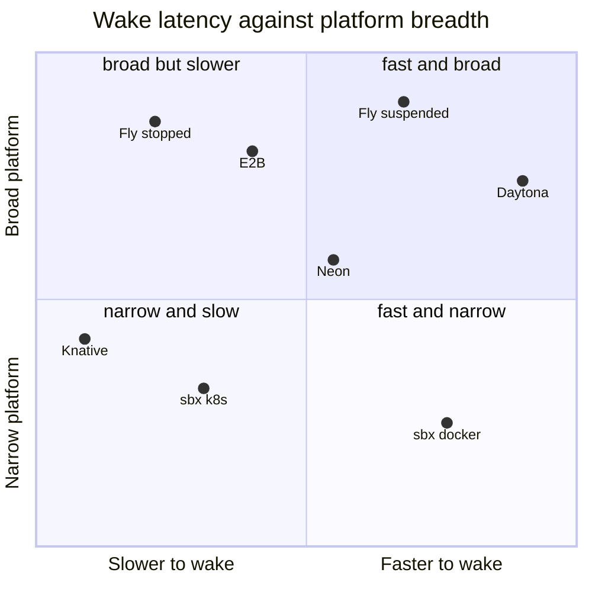
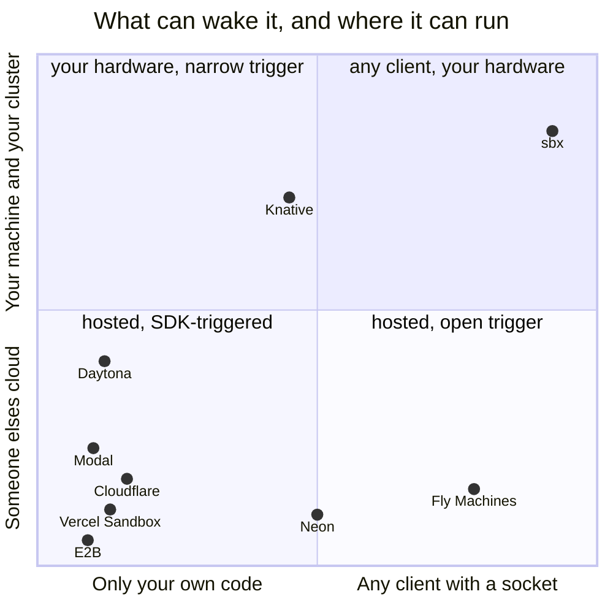

# Compared

Every figure here is either measured by a script in this repo or quoted from the vendor's own
documentation, with a link. Nothing is quoted from a competitor's marketing page about a
competitor.

---

## First, two different things are called "sandbox"

Most of the platforms people compare this to are not doing the same job. The word covers two
products that share almost nothing:

```
   A PLACE TO RUN CODE                    A PLACE TO RUN THE SERVICES
                                          YOUR BRANCH NEEDS
   ───────────────────────────            ───────────────────────────────
   unit    an execution session           unit    a long-lived set of ports
   client  an SDK you call                client  psql, redis-cli, a pool,
   sold on isolation                              Playwright, a test runner
   dies    when the task ends             sold on cost at rest
                                          lives  as long as the branch

   E2B · Daytona · Modal                  sbx · Neon · preview-env platforms
   Vercel Sandbox · Cloudflare
```

**sbx is the right-hand column.** If you are running untrusted model-authored code and need a
kernel boundary, the left-hand column is what you want, and this is not competing for that —
see [where to use something else](#where-to-use-something-else).

---

## The axis that actually separates them

Everybody scales to zero. The question nobody's table asks is **what has to happen to bring it
back**, because that determines who is allowed to be the client.

| | wakes on | so the client can be | runs off-cloud |
|---|---|---|---|
| **sbx** | **any TCP connection** | anything with a socket | **laptop + cluster** |
| E2B | `sandbox.connect()` — an SDK call | only your own code | ✗ hosted |
| Daytona | start/resume API call | only your own code | ✗ hosted |
| Modal | SDK call | only your own code | ✗ hosted |
| Vercel Sandbox | SDK call | only your own code | ✗ hosted |
| Cloudflare Sandbox SDK | SDK call over RPC | only your own code | ✗ hosted |
| Fly Machines | a request through Fly Proxy | anything, incl. TCP services | ✗ their proxy |
| Knative | an HTTP request through the activator | HTTP/gRPC/WebSocket only | ✓ needs a cluster |
| Neon | a Postgres connection | Postgres clients only | ✗ hosted |

**Why this is the whole point.** A connection pool cannot call `sandbox.connect()`. Neither can
`psql`, `pg_dump`, a migration tool, Playwright over CDP, or a test runner someone else wrote.
On any SDK-triggered platform, *something in your code* has to know the sandbox is asleep and
wake it first — which means every tool that touches it must be sandbox-aware.

Here, the socket is the signal. The tools stay unmodified and don't know they're talking to
something that was at 0 B a moment ago.

Two platforms get this right and are worth naming honestly: **Fly Proxy** wakes on a real
connection and supports TCP services, and **Neon** wakes on the Postgres protocol itself. Both
are hosted, both are excellent, and the ideas here are not novel against them — what's
different is that this runs on your laptop, with no account, on any protocol.

---

## What "asleep" costs, and what it keeps

| | at rest | wake | what survives |
|---|---|---|---|
| **sbx** | **0 B** | **191 ms** docker · 1534 ms k8s | disk. processes cold-start |
| E2B | storage only | **~1 s** | **disk + RAM + running processes** |
| Daytona | storage only | ~90 ms p99 reported | disk, persistent volume |
| Fly (suspended) | storage only | a few hundred ms | RAM snapshot |
| Fly (stopped) | storage only | ~2 s+ | disk |
| Neon | storage only | 300–800 ms | Postgres data |
| Knative | 0 pods | pod schedule, seconds | volume, if you attached one |

**The honest weakness, stated plainly.** E2B pauses to a memory snapshot: loaded variables and
running processes come back exactly as they were, at roughly 4 s per GiB to pause and ~1 s to
resume. sbx does not snapshot RAM. A sleeping sandbox is a stopped container with its volume
intact, so a wake is a **cold process start against warm data** — Postgres replays its WAL and
comes up, it doesn't resume mid-transaction.

That is a worse guarantee. It is also why a sleeping sandbox is genuinely **0 B** rather than
"storage only", and why sleeping costs nothing to enter — there is no 4 s/GiB checkpoint to pay
before the saving starts. For a database on a branch, disk-warm is the state that matters. For
an agent's half-finished Python REPL, it isn't, and E2B is the better tool.

---

## Where this sits

Two charts, because one of them flatters us and the other one doesn't, and only showing the
first would be the kind of comparison this file exists to avoid.

### 1 · Speed against breadth — the chart everyone draws



**We are in the bottom-right, and that is the correct place for us to be.** Fast, and narrow.
Anything claiming to be top-right on its own comparison page has chosen its own axes.

The breadth score deliberately excludes everything sbx is good at. It counts eight things we
mostly don't do — VM-grade isolation, RAM snapshotting, GPU, arbitrary stateful services, a
public URL, somebody else operating it, multi-tenant security, production-proven — at 1 for
yes and ½ for partial. Scored on the rows *we* would have picked, every one of these charts
would put us top-right, which is exactly why the score doesn't use them.

| | wake, ms | source | breadth | of 8 |
|---|---|---|---|---|
| Daytona | ~90 *reported* | third-party roundup | 0.81 | 6.5 |
| **sbx** docker | **191** | `scripts/bench.sh 20`, this repo | **0.25** | **2** |
| Fly, suspended | a few hundred | [vendor][fly] | 0.95 | 7.5 |
| Neon | 300–800 | [vendor][neon] | 0.60 | 4.8 |
| E2B | ~1000 | [vendor][e2b] | 0.88 | 7 |
| **sbx** kubernetes | **1534** | `scripts/bench.sh`, minikube | **0.30** | 2.5 |
| Fly, stopped | ~2000+ | [vendor][fly] | 0.95 | 7.5 |
| Knative | seconds, pod schedule | — | 0.50 | 4 |

Point positions are those scores, rounded a little so the labels don't sit on top of each
other; the table is the data, the chart is the shape.

⚠️ **The x-axis is not a fair race and is on a log scale.** Ours is loopback on an idle laptop;
theirs is a multi-tenant fleet across a network, and E2B's second restores a RAM image while
our 191 ms starts a process. [BENCHMARKS.md](BENCHMARKS.md#against-other-platforms) lists all
four reasons, and they all favour us. Modal and Cloudflare are absent because we could not
find a vendor-documented wake figure for either — a blank is better than a guess.

### 2 · The chart that explains why this exists

Same platforms, the two axes that are structural rather than measured — so no hardware,
network or region can flatter anybody.



**The top-right is empty apart from us, and that emptiness is the entire product.** Fly is far
right because its proxy wakes on a real connection, but it's their proxy in their cloud.
Knative is high because you run it yourself, but it only wakes on HTTP. Neon sits mid-x
because the Postgres wire protocol *is* the trigger — the right idea, one protocol wide.

Nobody else is in the corner where the wake needs neither an SDK nor an account. That is a
small corner. It happens to be the one a branch on a laptop lives in.

---

## Feature by feature

| | sbx | E2B | Daytona | Modal | Cloudflare | Fly | Neon | Northflank |
|---|---|---|---|---|---|---|---|---|
| Wakes on a raw socket | ● | ○ | ○ | ○ | ○ | ● | ◐ pg only | ○ |
| Runs on your laptop | ● | ○ | ○ | ○ | ○ | ○ | ○ | ○ |
| Same spec local + cluster | ● | ○ | ○ | ○ | ○ | ○ | ○ | ◐ |
| Self-hosted, no account | ● | ○ | ◐ OSS core | ○ | ○ | ○ | ○ | ◐ BYOC |
| Arbitrary stateful services | ● | ◐ | ● | ◐ | ◐ | ● | ○ pg | ● |
| Multiple services, one spec | ● | ○ | ○ | ○ | ○ | ◐ | ○ | ● |
| Zero cost at rest | ● | ◐ storage | ◐ storage | ◐ storage | ◐ storage | ◐ storage | ◐ storage | ○ |
| RAM-state snapshot | ○ | ● | ● | ● | ◐ | ● | n/a | ○ |
| VM-grade isolation | ○ | ● | ◐ | ● | ● | ● | ● | ● |
| Public URL per sandbox | ● | ● | ● | ● | ● | ● | n/a | ● |
| GPU | ○ | ◐ | ◐ | ● | ○ | ● | n/a | ● |
| Production-proven | ○ | ● | ● | ● | ● | ● | ● | ● |

● yes · ◐ partial or conditional · ○ no

**Read the bottom two rows before the top two.** Every hosted platform on this table has real
isolation and real users. This has neither. What it has is the first four rows, and whether
that trade is right depends entirely on whether your sandbox is running your own services or
somebody else's code.

---

## Where to use something else

| If you need | Use | Why |
|---|---|---|
| To run genuinely untrusted code | **E2B, Vercel Sandbox, Modal** | Firecracker microVMs. A container shares your kernel |
| An agent's REPL resumed mid-thought | **E2B** | RAM snapshot. This restores disk only |
| A URL per pull request, for reviewers | **Northflank, Uffizzi, Okteto** | Built for the PR lifecycle, with teardown |
| Serverless Postgres, hosted, that's it | **Neon** | Branching and scale-to-zero, operated by someone else |
| Ephemeral fixtures inside a test run | **Testcontainers** | Ephemeral is the whole design; nothing to sleep |
| HTTP-only, already on Knative | **Knative** | Mature, and this is not |
| GPU on the sandbox side | **Modal** | No substitute at the moment |

---

## Sources

Vendor documentation, read August 2026:

- [E2B — sandbox persistence](https://docs.e2b.dev/sandbox/persistence): `sandbox.connect()` to
  resume; ~4 s per GiB to pause, ~1 s to resume; filesystem *and* memory state preserved.
- [Fly Proxy autostop/autostart](https://fly.io/docs/reference/fly-proxy-autostop-autostart/):
  "The proxy waits for a request to your app… starts a stopped or suspended Machine". Also:
  "only works on existing Machines and never creates or destroys Machines for you."
- [Fly — machine suspend and resume](https://fly.io/docs/reference/suspend-resume/)
- [Cloudflare Sandbox SDK](https://developers.cloudflare.com/sandbox/): `sleepAfter` idle sleep;
  [tunnels API](https://developers.cloudflare.com/sandbox/api/tunnels/) via `cloudflared`, which
  [replaced `exposePort()`](https://developers.cloudflare.com/changelog/post/2026-06-09-deprecating-sandbox-sdk-features/)
  in 2026 — the same conclusion this repo reached about its own tunnel, independently.
- [Knative — configuring scale to zero](https://knative.dev/docs/serving/autoscaling/scale-to-zero/)
  and [the activator on the data path](https://knative.dev/blog/articles/demystifying-activator-on-path/).
- [Neon — connection latency](https://neon.com/docs/connect/connection-latency): a few hundred ms
  from idle; scale-to-zero after 5 minutes by default.
- [Vercel Sandbox](https://vercel.com/docs/vercel-sandbox), [Modal sandboxes](https://modal.com/docs/guide/sandbox),
  [Daytona](https://www.daytona.io/docs/), [Northflank preview environments](https://northflank.com/blog/preview-environment-platforms).

Third-party benchmark figures (Daytona ~90 ms p99, Modal/E2B comparisons) come from published
2026 roundups rather than a harness in this repo, and are marked "reported" wherever they
appear. **They were not reproduced here**, and cross-platform latency numbers taken on
different hardware, in different regions, against different images are not a like-for-like
measurement. Ours are in [BENCHMARKS.md](BENCHMARKS.md) with the machine and the script beside
them; theirs are on their own machines.
