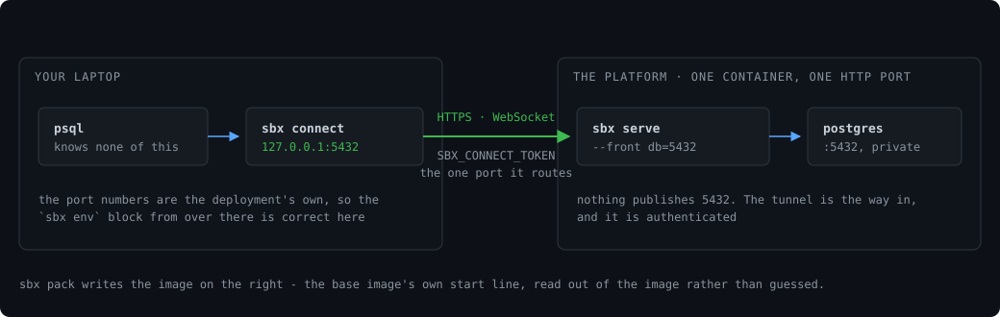

# Guides

How to do each common task with sbx, one section per task, with commands you can paste. Flags are in
[CLI.md](CLI.md), `sandbox.json` fields in [SPEC.md](SPEC.md), and error messages in
[TROUBLESHOOTING.md](TROUBLESHOOTING.md). New to sbx? Start with [QUICKSTART.md](QUICKSTART.md).

**Contents**

- [Before you start](#before-you-start)
- [A database per branch](#a-database-per-branch)
- [Test fixtures in CI](#test-fixtures-in-ci)
- [Seed once, fork many](#seed-once-fork-many)
- [Save and resume a running process](#save-and-resume-a-running-process)
- [Add a service mid-task](#add-a-service-mid-task)
- [Share a preview link](#share-a-preview-link)
- [A browser that sleeps](#a-browser-that-sleeps)
- [Work inside a sandbox](#work-inside-a-sandbox)
- [Keep a sandbox awake, or limit where it can connect](#keep-a-sandbox-awake-or-limit-where-it-can-connect)
- [AI agents](#ai-agents): [paste block](#paste-this-into-your-agents-instructions) ·
  [MCP](#mcp) · [OpenSandbox SDKs](#opensandbox-sdks)
- [Stronger isolation with microVMs](#stronger-isolation-with-microvms)
- [Kubernetes](#kubernetes)
- [Deploy on a one-port platform](#deploy-on-a-one-port-platform)
- [Coming from docker compose, Testcontainers or E2B](#coming-from-docker-compose-testcontainers-or-e2b)

## Before you start

Every guide assumes one sbx daemon on the machine. It owns the ports `sbx env` prints, wakes a
service when something connects, and puts it back to sleep after `--idle` with no traffic.
[`deploy/`](../deploy/) has a launchd plist and a systemd unit to keep it running.

```sh
sbx serve --idle 5m &
```

## A database per branch

Branches that share one database share every migration. A sandbox gives each branch its own,
and a sleeping sandbox holds 0 B of RAM: no container runs until something connects.

```sh
sbx create feature-x --template postgres
eval "$(sbx env feature-x)"        # sets PGHOST, PGPORT, DATABASE_HOST, DATABASE_PORT
psql -U app -d app -c 'select 1'   # this connection wakes it
```

Never hardcode a port: ports are assigned per sandbox, and `sbx env` is where they live.
`sbx templates` lists the other built-in specs; [examples/](../examples/) explains each one.

## Test fixtures in CI

**A fixture that lives exactly as long as one command.** `sbx with` creates the sandbox, waits
until every service answers, runs the command with the addresses set, then removes the sandbox,
even when the command fails or is interrupted. It exits with the command's status.

```sh
sbx with test-db --template postgres -- go test ./...
```

`--keep` leaves the sandbox in place so you can look at it afterwards.

**A stack a job waits on,** kept for the next job on a persistent runner:

```sh
sbx create "$BRANCH" && sbx ready "$BRANCH"    # ready blocks until every service answers
eval "$(sbx env "$BRANCH")"
./run-tests.sh
```

On a shared runner, name sandboxes after branch *and* job; see
[TROUBLESHOOTING.md](TROUBLESHOOTING.md#on-a-shared-or-persistent-ci-runner).

## Seed once, fork many

Loading data is the slow part, not starting a container. Seed one sandbox, take a snapshot (a copy
of every service's files), and fork as many independent copies as you need.

Seed in the spec, so the starting state is reproducible. `init` runs once, after the first
healthy check:

```json
{ "version": 1,
  "services": { "postgres": {
    "image": "postgres:16-alpine", "ports": [5432], "volume": "/var/lib/postgresql/data",
    "env": { "POSTGRES_USER": "app", "POSTGRES_PASSWORD": "app", "POSTGRES_DB": "app" },
    "health": "psql -U app -d app -c 'select 1'",
    "files": { "./schema.sql": "/tmp/schema.sql" },
    "init": [ "psql -U app -d app -f /tmp/schema.sql" ] } } }
```

```sh
sbx create main                # seeded by init, once
sbx snapshot main golden
sbx fork golden agent-1        # its own copy and its own ports
sbx fork golden agent-2        # a write in one is invisible to the others
```

Or seed a running sandbox by hand:

```sh
sbx cp   main postgres ./schema.sql :/tmp/schema.sql
sbx exec main postgres psql -U app -d app -f /tmp/schema.sql
```

A snapshot copies files, not memory, so forks start cold against warm data. It does not pause the
service; stop writes first if the copy must be exact
([why](TROUBLESHOOTING.md#a-fork-is-missing-the-write-i-just-made)).

## Save and resume a running process

A normal wake starts the service fresh against its disk. To get the *process* back (a REPL's
variables, a warm cache), take a checkpoint. It uses CRIU (Checkpoint/Restore In Userspace, a
Linux tool that saves a running process's memory to disk).

```sh
sbx checkpoint agent-42 mid-thought    # save memory and processes, and freeze them
sbx resume     agent-42 mid-thought    # bring them back as they were
```

Linux with a podman runtime only; refused on macOS. Status: [README](../README.md#platform-status).
To keep memory across ordinary sleeps instead, set `"on_idle": "freeze"`
([SPEC.md](SPEC.md#on_idle-freeze-keeps-memory-instead)).

## Add a service mid-task

A task that discovers it needs a cache or a second database adds one to its sandbox. The new
service gets a port from the sandbox's range, sleeps when idle, and is removed with the sandbox.

```sh
sbx add my-task cache --image redis:7-alpine --port 6379 --health 'redis-cli ping'
eval "$(sbx env my-task)"
```

## Share a preview link

`sbx url` opens a public tunnel (through cloudflared, ngrok or ssh) to one service. The service
sleeps until somebody opens the link.

```sh
sbx url my-branch web                   # https://....trycloudflare.com; --via ngrok to choose
```

A browser waiting on a slow wake sees a blank page. The `waiting-page` preview feature shows a
"starting" page instead, for HTTP only:

```sh
SBX_FEATURES=waiting-page sbx serve --idle 5m &
```

A per-pull-request workflow on a host you own is in [examples/pr-preview](../examples/pr-preview/).

## A browser that sleeps

Headless Chrome is a container that speaks TCP, so it sleeps and wakes like a database. Playwright
and Puppeteer drive it over CDP (the Chrome DevTools Protocol).

```sh
sbx create my-branch --template browser
eval "$(sbx env my-branch)"
curl "http://$CDP_HOST:$CDP_PORT/json/version"     # wakes it
```

Wake times, mostly Chrome's own startup, are in
[BENCHMARKS.md](BENCHMARKS.md#a-heavier-workload-headless-chrome). More: [examples/browser](../examples/browser/).

## Work inside a sandbox

A service image such as postgres has no git or compiler. To build, test or edit *inside* a
sandbox, declare a service that holds your tools and mounts your source:

```json
{ "version": 1,
  "services": { "dev": {
    "image": "golang:1.26-alpine", "ports": [7777],
    "args": ["sleep", "infinity"], "mounts": { ".": "/work" } } } }
```

```sh
sbx create my-branch
sbx exec -t my-branch dev sh           # a shell in /work with your code; wakes it first
sbx exec my-branch dev go test ./...
```

- `args` keeps the container running. `ports` is required but can be any port you do not use.
- `"."` is the spec's directory, and writes go both ways. On macOS and Windows it must be a path
  the docker VM shares (under your home directory). `mounts` works on docker only.

**From an editor (preview feature).** An ssh connection wakes the sandbox like any other, so VS
Code Remote-SSH, JetBrains Gateway, `scp` and `rsync` work. The image must run an ssh server.

```sh
SBX_FEATURES=ssh sbx ssh feature-x --user dev   # prints the ssh and `code --remote` lines
```

An attached editor keeps the sandbox awake (VS Code pings every five seconds); close it and it sleeps.

**From a devcontainer (preview feature).** Import `.devcontainer/devcontainer.json` as a starting
spec. What cannot be translated is listed on stderr.

```sh
SBX_FEATURES=devcontainer sbx init --from-devcontainer . > sandbox.json
```

## Keep a sandbox awake, or limit where it can connect

sbx decides a service is idle by counting bytes through its ports. Work that only happens inside
(compiling, an agent editing files) sends none, so the sandbox sleeps mid-task. Pick one:

| you want | write in the service |
|---|---|
| a longer idle window | `"idle": "30m"` |
| never sleep (holds its memory the whole time) | `"idle": "never"` |
| keep memory while asleep, resume in about 10 ms | `"on_idle": "freeze"` |
| reach only these hosts, and stay awake while calling them | `"egress_allow": ["api.anthropic.com", "pypi.org"]` |
| no outbound network at all | `"egress": "deny"` |

"Egress" is traffic going *out* of the sandbox. With `egress_allow`, calls out go through a
filtering proxy that sbx runs, reach only the listed hosts, and count as activity:

```json
{ "version": 1,
  "services": { "agent": {
    "image": "python:3.12", "ports": [7777],
    "egress_allow": ["api.anthropic.com", "pypi.org", "github.com"], "idle": "10m" } } }
```

Tighten a running sandbox without a restart: `sbx egress agent-1 --deny '*.pastebin.com'`.
Rules, limits and the `egress_policy` form are in [SPEC.md](SPEC.md#egress-the-network-a-service-may-reach).

## AI agents

A coding agent (Claude Code, Cursor, Codex and others) can give itself databases and services
with the same commands a person uses. Three ways in:

- **Plain shell commands**: paste the block below into your agent's instructions. Nothing to install
  beyond sbx.
- **MCP** (Model Context Protocol, the standard way to hand an AI app a set of tools): `sbx mcp`.
- **OpenSandbox SDKs**: code that already creates sandboxes through an SDK.

### Paste this into your agent's instructions

Put it in your project's `AGENTS.md` or `CLAUDE.md`.

```markdown
## Sandboxes (sbx)

When you need a service to do your work - a database to run a migration against, a redis, a
browser, a queue - create a sandbox for it. Do not `docker run` it, do not `docker compose up`,
and do not connect to a shared local database.

    sbx doctor --json                     # what this machine can do; run it first if anything is odd
    sbx list --json                       # what already exists
    sbx create <task> --template postgres # one for this task. Templates: sbx templates
    eval "$(sbx env <task>)"              # exports its addresses into your shell
    sbx ready <task>                      # block until it really answers, for scripts

There is no start and no stop. **Connecting is what wakes a service** - psql, a driver, a test
runner, curl - and idleness puts it back to sleep, using 0 B of RAM. Never hardcode a port: read
it from `sbx env`, which is the only place the real numbers exist. The variable names come from
the spec's `exports` (the postgres template gives `DATABASE_HOST` and `DATABASE_PORT`), so run
`sbx env <task>` and read them rather than assuming.

    sbx add <task> cache --image redis:7-alpine --port 6379 --health 'redis-cli ping'
    sbx exec <task> postgres psql -U app -d app -c 'select 1'
    sbx logs <task> postgres --tail 50
    sbx rm <task>                         # when the task is done. This deletes its data.

    sbx with <task> --template postgres -- <cmd>   # one-shot: create, run <cmd> with env set,
                                                   # then ALWAYS rm - even if <cmd> fails. Its
                                                   # exit code becomes sbx's. For a scoped test run.

Rules:
- One sandbox per task or branch, named after it. Do not reuse another task's.
- `sbx rm` only the sandbox you created. Somebody else's may be in use.
- Nothing is shared between sandboxes, so a migration in yours affects nothing else.
- If the addresses from `sbx env` refuse connections, no daemon is running: start
  `sbx serve --idle 5m &` once for the machine, then retry.
- If a command fails, run `sbx doctor` before guessing: it says whether docker is even up.
```

The block assumes one `sbx serve` per machine. `sbx ready` exists because an open port is not yet
a database that answers. Output an agent can parse:

| command | gives |
|---|---|
| `sbx list --json` | every sandbox and service, with `awake`, `addresses`, `ref` |
| `sbx env <sandbox> --shell json` | the addresses as an object |
| `sbx doctor --json` | capabilities; each missing one says what it costs |
| `sbx history [sandbox] --json` | newline-delimited wakes, sleeps and changes |
| `sbx egress <sandbox> --json` | the network policy in force |

Every refusal names the field or flag it came from. The ones agents hit most: `build`,
`egress` or `sbx url` on Kubernetes; lifting a CPU or memory limit on a running docker container;
`sbx connect` over plain `http://` to a remote host; a non-root image on firecracker.

### MCP

`sbx mcp` is an MCP server that your client starts as a subprocess. It has
**the same 19 tools as OpenSandbox's own MCP server**: same names, arguments and results. It
talks to the OpenSandbox API, so **the daemon must serve that API first**:

```sh
sbx serve --osb-addr 127.0.0.1:8080 &     # writes an API key to ~/.sbx/osb/key
```

Then register it with your client:

```sh
claude mcp add sbx -- sbx mcp             # Claude Code; sbx mcp reads the key file itself
codex mcp add sbx -- sbx mcp              # Codex CLI
claude mcp add sbx -e SBX_OSB_KEY="$KEY" -- sbx mcp --url https://osb.example.dev   # a remote server
```

Cursor (`.cursor/mcp.json`), or any client that reads an `mcpServers` block:

```json
{ "mcpServers": { "sbx": { "command": "sbx", "args": ["mcp"],
                           "env": { "SBX_OSB_URL": "http://127.0.0.1:8080" } } } }
```

`sbx mcp` finds its server and key in this order:

| setting | order |
|---|---|
| `--url` | `SBX_OSB_URL`, `OPEN_SANDBOX_DOMAIN`, `http://127.0.0.1:8080` |
| `--key` | `SBX_OSB_KEY`, `OPEN_SANDBOX_API_KEY`, then `~/.sbx/osb/key` for a loopback URL only |

| group | tools |
|---|---|
| sandbox | `sandbox_create` `sandbox_connect` `sandbox_kill` `sandbox_get_info` `sandbox_list` `sandbox_renew` `sandbox_healthcheck` `sandbox_get_metrics` `sandbox_get_endpoint` |
| commands | `command_run` `command_interrupt` |
| files | `file_read` `file_write` `file_delete` `file_search` `file_create_directories` `file_delete_directories` `file_move` `file_replace_contents` |

Because the names match, swapping upstream's `opensandbox-mcp` for `sbx mcp` needs no other
change. Differences: any `sandbox_id` works in any tool (no `connect_if_missing` needed);
cancelling `command_run` interrupts the command; `file_read` and `file_write` take `utf-8` or
`latin-1` only. It speaks MCP `2025-11-25` back to `2024-11-05` and logs to stderr only.

### OpenSandbox SDKs

[OpenSandbox](https://github.com/opensandbox-group/OpenSandbox) is an open-source API standard for
AI-agent sandboxes, with SDKs in 5 languages. `sbx serve --osb-addr` serves its lifecycle API, so
code written for those SDKs runs against sbx on your own machine, with no account. The claim is
checked by upstream's own test suite ([test/osb](../test/osb/)).

```sh
sbx serve --osb-addr 127.0.0.1:8080 &
export OPEN_SANDBOX_DOMAIN=127.0.0.1:8080
export OPEN_SANDBOX_PROTOCOL=http
export OPEN_SANDBOX_API_KEY="$(cat ~/.sbx/osb/key)"
```

**The key is always required**, loopback included, because on colima and Docker Desktop every
container can reach the host's `127.0.0.1`. Set your own with `--osb-key` or `SBX_OSB_KEY`;
otherwise one is generated once into `~/.sbx/osb/key`.

Python (`pip install opensandbox`, written against SDK 1.1.0):

```python
from opensandbox import SandboxSync
from opensandbox.config import ConnectionConfigSync

config = ConnectionConfigSync()  # reads OPEN_SANDBOX_DOMAIN and OPEN_SANDBOX_API_KEY
sandbox = SandboxSync.create("python:3.11-slim", connection_config=config)
try:
    result = sandbox.commands.run("python -c 'print(6 * 7)'")
    print(result.logs.stdout[0].text)
finally:
    sandbox.destroy()
```

**Warm pools.** A warm pool is a set of sandboxes created ahead of time, so a create is answered
from the pool in milliseconds ([BENCHMARKS.md](BENCHMARKS.md#headline-numbers)).
`sbx serve --osb-pool IMAGE[=N]` keeps N ready (default 8). Only an identical create hits the pool:

- Members are keyed on image, entrypoint and `resourceLimits`, plus ports, platform and `sbx.idle`.
- The pool is built with the SDK defaults: entrypoint `["tail", "-f", "/dev/null"]`, `cpu: "1"`,
  `memory: "2Gi"`. A plain SDK `create(image)` sends exactly those, so it hits.
- A request that omits `resourceLimits` or sets another entrypoint takes the slow path, and the
  daemon log says why:
  `osb: pool miss for image "python:3.11-slim": resourceLimits.cpu is unset, the pool's is "1" - it takes the cold path…`
- On a Mac or Windows with `--provider firecracker`, the pool is refused.

Other operator flags (`--osb-host-paths`, `--osb-pool-freeze`) are in [CLI.md](CLI.md#sbx-serve);
the security model is in [SECURITY.md](../SECURITY.md).

## Stronger isolation with microVMs

A container shares the host's kernel, so a kernel bug inside it can reach the host. A microVM is a
small virtual machine with its own kernel; [Firecracker](https://firecracker-microvm.github.io/)
is the open-source microVM monitor AWS built for Lambda. Use it for code you did not write:
agent output, user submissions. sbx starts each Firecracker process through its jailer, which
confines it to its own directory, user id and network namespace.

```sh
sbx fc backend                                  # can this machine run microVMs, and how?
sbx serve --provider firecracker --idle 5m &
sbx create untrusted --spec sandbox.json --provider firecracker
```

On Linux with `/dev/kvm` it runs directly. On an M3 or later Mac, or Windows 11, it runs inside a
helper VM (a small Linux VM that sbx starts on demand with lima, colima or WSL2). What is tested
where: [README platform status](../README.md#platform-status). Some spec fields are refused and
the image must run as root: [SPEC.md](SPEC.md#on---provider-firecracker).

Lighter options: `--isolation gvisor` (gVisor, a user-space kernel that intercepts the container's
system calls) or `--isolation kata` (Kata Containers, each container in a lightweight VM). Each is
refused with a reason when its runtime is not installed.

## Kubernetes

The same `sandbox.json` runs in a cluster. sbx drives `kubectl`, so it uses your current context.

```sh
sbx create my-branch --provider kubernetes --namespace sbx
sbx env    my-branch --provider kubernetes
```

Each service becomes a Deployment and a Service; `exports` point at cluster-internal addresses.
The daemon's job in the cluster is done by the activator, `sbx serve` running as a Deployment: it
holds an incoming connection, scales the workload up from zero, and passes the bytes through.
Install it once per cluster from [`deploy/activator.yaml`](../deploy/activator.yaml); build its
image first as [`deploy/Dockerfile`](../deploy/Dockerfile) describes. Some fields are refused rather than half-applied,
and `sbx url` points you at an Ingress: see [SPEC.md](SPEC.md#provider-support).

## Deploy on a one-port platform

Some platforms run one container behind one HTTPS port. `sbx pack` turns each service into a
build context for such a platform, and `sbx connect` gives you local ports that tunnel to them.
Use it when your laptop cannot run the stack, or to keep an agent off your machine.



```sh
sbx pack --spec sandbox.json          # one build context per service, under sbx-pack/
# deploy sbx-pack/db/ and sbx-pack/cache/, each with SBX_CONNECT_TOKEN set

SBX_CONNECT_TOKEN_DB=... SBX_CONNECT_TOKEN_CACHE=... \
  sbx connect db=https://db.example.dev cache=https://cache.example.dev
#   db     ->  127.0.0.1:5432
#   cache  ->  127.0.0.1:6379
```

Watch and control the deployments from one dashboard (wake, sleep, limit, remove, logs):

```sh
sbx ui --connect db=https://db.example.dev --connect cache=https://cache.example.dev
```

`--front` reaches something the container can route to and you cannot, such as a managed
database on a private network:

```sh
sbx serve --connect-addr=":$PORT" --behind-proxy --front db=10.0.4.7:3306
```

- **The token is the whole of the security.** With `--front HOST:PORT` it guards everything that
  container can reach on those ports. Read [SECURITY.md](../SECURITY.md) first.
- **No volume means no data** on most such platforms, which replace containers freely.
- **Every round trip crosses the internet.** A chatty test suite will notice.

## Coming from docker compose, Testcontainers or E2B

**docker compose.** Most service fields map one to one; the full table and a worked example are
in [SPEC.md](SPEC.md#coming-from-docker-compose). The differences that matter: you declare only
the container port (the host port is assigned), there is no `up` or `down`, and `exports` keeps
the variable names your scripts already read.

**Testcontainers** (a library that starts containers from inside test code). Instead of starting
the container in the test, wrap the test command, and read the address from the environment:

```sh
sbx with test-db --template postgres -- npm test   # tests read DATABASE_HOST / DATABASE_PORT
```

The sandbox is removed when the command exits, as a Testcontainers container is. Unlike one, it
can also stay between runs (`sbx create` once, then `sbx ready` per run), asleep in between.

**E2B, Daytona and other hosted sandbox SDKs.** Their SDKs speak their own APIs, which sbx does not
serve. sbx serves the OpenSandbox API, whose SDK has the same shape: create a sandbox from an
image, run commands, read and write files, kill it. Port the calls to the OpenSandbox SDK
([above](#opensandbox-sdks)) and point it at `sbx serve --osb-addr`. Code already written for
OpenSandbox needs only the three environment variables. How the platforms compare:
[COMPARISON.md](COMPARISON.md).
